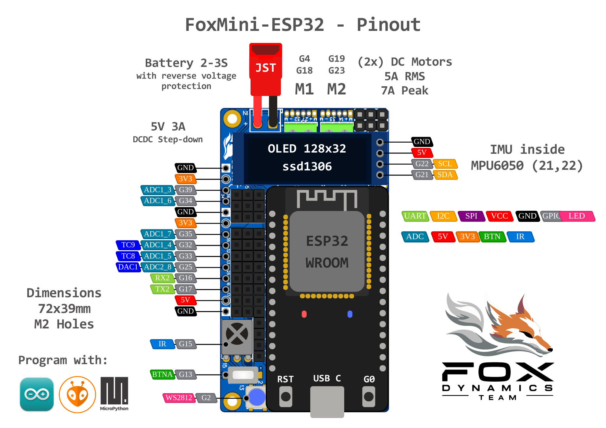

# FoxMini_ESP32
FoxMini ESP32 - Robot Mother Board

## Pinout Inconpleto

## Hardware
- **Micrcontrolador:** ESP32 (WiFi, Bluetooth e ESPNOW)
- **Motores Bidirecional:** 2 Motores escovados 5A continuos e 7A pico
- **Motores Unidireciona:** 1 Motor escovado 3A
- **Display:** OLED ssd1306
- **Alimentação:** LiPo 2 a 3S (5 a 14V) conector JST e proteção contra polaridade reversa
- **Saidas de tensão:** 5V 2A (DC-DC buck) e 3V3 (linear)
- **2 Saidas Servo:** GPIO 5 e 19
- **Receptor infravermelho:** VS1838 (GPIO 15)
- **GPIO 3V3:** GPIO 39, 34 e 35
- **GPIO 5V ou mais (\*):** GPIO 35, 32, 33, 25, 26, 27, 14 e 13
- **Serial2:** GPIO 16 e 17
- **Botões:** GPIO 0 e 13
- **LED ws2812b:** GPIO 2
- **Versão opcional:** + MPU6050 (Unidade de Medição Inercial)

(*) A proteção é configuravel, pode ser desabilitada para melhorar a leitura em 3V3

## Exemplos Arduino
[Exemplos Arduino](./examples)
- Demo