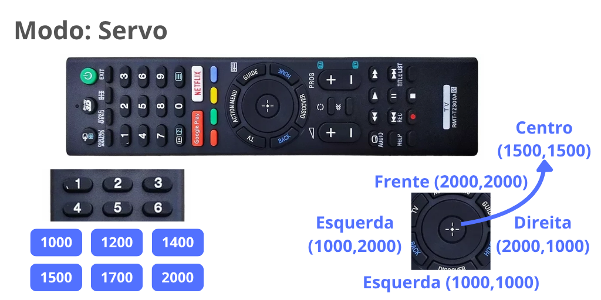

# IrKey

*Firmware V1.0*


Módulo Leitor IR 3 em 1.  

* `IR-Start` Acionamento de robôs de sumô ou Seguidor de Linha, via Controle remoto ou botão com 5 segundos.
* Receptor IR para 2 servos
* Leitor IR-Serial

Protocolos disponiveis no momento:  

* SONY
* SAMSUNG

## Pinout


| Pino  | Descrição  |
|-------|------------|
|**Vcc**| Alimentação 3V3 a 5V |
|**GND**| Alimentação 0V |
|**S**  | saida digital 0 ou 1 |
|**FX** | saida USART Halfduplex (Leitura/Escrita) * |

**Obs:** O pino **FX** só trabalha com 3V3. Não é tolerante a 5V.

## Utilização Modo IR-Start

Ao ligar, o modulo inicia no modo `IR-Start`, recebendo comando do controle do juiz seguindo a sequência de inicialização. Também é possivel acionar usando o botão com cliques. 


| comando | botão |  ação |
|---------|-------|-------|
| Prepare | 1 |  prepara o robô o LED de status pisca Azul |  
| Start | 2 |  A saida é acionada, acendendo o led da saida e o LED de status fica verde continuamente |  
| Stop | 3|  A saida é desacionada, apagando o led da saida e o LED de status fica vermelho continuamente |  
| Start 5S | - |  Conta 5 segundos e depois inicia, mudando a cor de amarelo para verde aos poucos |  


### Leitura dos comandos IR via pino FX

Cada comando recebido é enviado via USART no pino **FX**. Essa funcionalidade pode ser desativada via registrador `CTRL` (mais detalhes em **configuração**). 

As mensagens iniciam com o caracter ">" em seguida os dados são enviadas em formato CSV separado por virgula e com caracteres de fim de "\n\r".

Formato:

* Header: ">"
* Protocolo: "SONY" ou "SAMSUNG"
* Comando (Hexadecimal)
* Endereço (Hexadecimal)
* Codigo completo (Hexadecimal)

`">[Protocolo],[Comando],[Endereço],[Código]"`

*Exemplo: Comando SONY, Botão 1*

`">SONY,0,7,70"`

## Modos de operação

Existe 3 modos de operação: `IR-Start` (Default), `Configuração` e `Servo`. No modo [`IR-Start`](#utilização-modo-ir-start) ele faz a sequancia de inicialização. O modo `Configração` permite alterar configurações como cor e brilho de cada comando. O modo `Servo` serve para testar servos ou para controlar escs e robôs usando um controle remoto.

A alteração de um modo para outro é feita usando o botão. A imagem a seguir ilustra a sequancia de transição entre os modos.

* `Configuração`: pressione o botão por cerca de 1,5s até o led começar a piscar rapidamente na cor roxa. Para salvar, pressione e segure o botão por cerca de 1,5s até o led começar a piscar rapidamente na cor roxa e depois ficar Roxo durante alguns milisegundos enquanto salva, ao final ele reinicia a chave. Para sair sem salvar basta dar um clique curto.
* `Servo`: pressione o botão por cerca de 5s até o led acender na cor azul esverdeada. Para retornar a `IR-Start` (Modo Default) basta dar um clique curto.


## Modo `Configuração`

No controle remoto clique no botão que deseja alterar a cor, por exemplo botão 1 (`prepare`). O LED ficará piscando na cor correspondente. Opções:

* **Botão direito e esquerdo:** muda a cor, aumentando ou diminuindo o valor de HUE.
* **Botão pra cima e baixo:** reduz ou aumenta o brilho.
* **Botão centro (ok):** retorna a respectiva cor padrão.

*Ao final salve a configuração segurando o botão por cerca de 1.5s.*


## Modo `Servo`

Nesse modo cada botão corresponde a um conjunto de valores do PWM para S e FX.

| Botão | PWM S | PWM FX |
|---|------|--|
| 1 | 1000 | 1000 |
| 2 | 1200 | 1200 |
| 3 | 1400 | 1400 |
| 4 | 1500 | 1500 |
| 5 | 1700 | 1700 |
| 6 | 2000 | 2000 |
| centro  | 1500 | 1500 |
| Frente  | 2000* | 2000* |
| Atras   | 1000* | 1000* |
| Direita | 2000* | 1000* |
| Esquerda| 2000* | 1000* |

**(*):** Quando o botão é solto ele retorna para S=1500 e FX=1500.



## Registradores de Configuração

Este dispositivo possui registradores que armazenam valores que determinam as configurações, como: cor de cada ação e protocolos aceitos. A tabela abaixo descreve os registradores:

| Registrador | Addr | bytes | Informações |
|------|------|------|-----|
| Addr | 0 | 1 | Endereço do dispositivo |
| CTRL | 2 | 1 | Registrador de Controle |
| Protocolo start | 3 | 1 | seleciona os protocolos para `IR-start` |
| Btn_mode | 4 | 1 |  |
| Cor Preparar | 5 | 4 |  |
| Cor On       | 9 | 4 |  |
| Cor Stop     | 13| 4 |  |
| Protocolo servo | 17| 1 | seleciona os protocolos IR para `SERVO` |
| Cor servo | 18| 4 | Cor no modo servo |
| Nome | 47| 16 | Nome do dispositivo |

### Lista de comandos do Shell

* `help` lista os comandos disponiveis
* `exit` encerra o shell
* `register` lê ou escreve um registrador de 8bits
* `dump` lista as principais configurações
* `vcc` mede a tensão aplicada no microcontrolador
* `reset` reinicia o sensor
* `save` salva as alterações realizadas
* `restore` restaura as configurações de fábrica
* `restore` restaura as configurações de fábrica sem alterar o endereço
* `read` lê o sensor
* `samsung_start_enable` habilita a recepção de comandos SAMSUNG
* `samsung_start_disable` desabilita a recepção de comandos SAMSUNG
* `servo_enable` habilita o modo servo
* `servo_disable` desabilita o modo servo  

Cores: [ RED=0 (0:255) ][ GREEN=0 (0:255) ][ BLUE=0 (0:255) ]

* color_stop
* color_start
* color_prepare
* color_serv


## Conexão com o computador

Utilize uma placa Fox Link, ou monte uma com  Arduino UNO ou Nano, fazendo upload nele do codigo abaixo.

```c++
// Fox Dynamics
// FoxLink bitwise ASM V0.2
#include <avr/io.h>

int main() {
  DDRD = (1 << PD1);
  PORTD = (1 << PD0);
  while (1) {
      asm volatile (
          "in r0, %[pin]" "\n\t"
          "bst r0, 0" "\n\t"
          "bld r0, 1" "\n\t"
          "out %[port], r0" "\n\t"
          :
          : [pin] "I" (_SFR_IO_ADDR(PIND)),
            [port] "I" (_SFR_IO_ADDR(PORTD))
          : "r0"
      );
  }
}
```

### Circuito


### Ferramentas para configurar

Atualmente existe as seguintes opções:

* Arduino IDE com Serial monitor ou outro. Usando comandos de texto.
* `foxwire cli` Comandos via foxwire usando cli python ([instale usando pip](https://pypi.org/project/foxwire/)).
* `foxwire webtool` configuração de forma gráfica e simples. *Mais recomendado!*

## Configuração no Foxwire WebTool

[FoxLink Webtool](https://luisf18.github.io/FoxLink_web_tool/)

1. Clique em conectar e escolha a porta COM
2. Clique em scan, ele irá scanear os dispositivos conectados
2. Irá aparecer um card como o da imagem abaixo onde é possivel visualizar e alterar as configureções.


