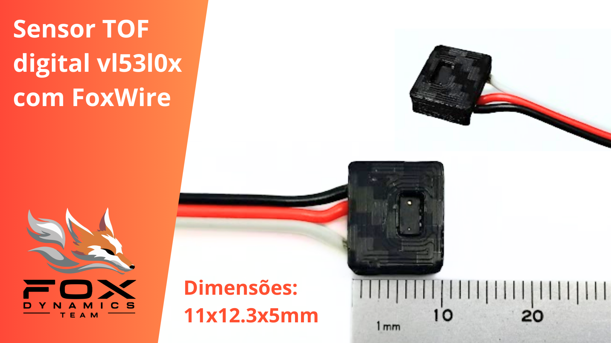
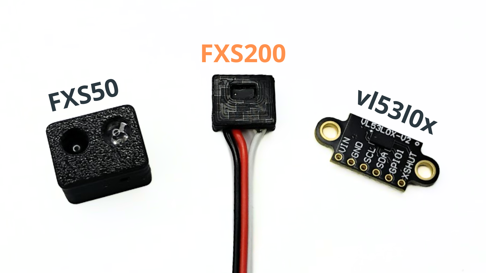

# Sensor FX-S200

_Documentação em desenvolvimento_

**EN:** The **FXS200** is a digital distance sensor. It uses the **VL53L0X** sensor and an embedded microcontroller that optimizes and simplifies its interface, making it very easy to use. It can function as an object detection sensor via digital output or measure distance and adjust parameters through the **FoxWire** pin. This makes it ideal for mini sumo robots.

**PT:** O **FXS200** é um sensor de distância digital. Ele utiliza o sensor **VL53L0X** e um microcontrolador que otimiza e facilita sua interface, tornando-o muito simples de usar. Pode atuar como sensor de detecção via saída digital ou medir distância e ajustar parâmetros pelo pino **FoxWire**. Isso o torna ideal para robôs de mini sumô.




**Video demonstrativo:** [https://www.youtube.com/shorts/WvjEp0M7mYg](https://www.youtube.com/shorts/WvjEp0M7mYg) 

**Datasheet:** _em breve_

## Características Técnicas

| Característica         | Valor                 |
|------------------------|-----------------------|
| Tipo de sensor         | Obstaculos digital ajustavel e distância    |
| Faixa de medição       | 0 a 200cm (*)  |
| Tensão de operação     | 3,3 a 5V      |
| Interface de comunicação | Saida digital e pino Fox Wire |
| Dimensões                | 11 x 12,3 x 5 mm    |
| Peso        | 1,7 g  |

(*) Depende de ajustes dos parametros de medição.

### Modelo 3D

_em breve_

## Comparação com outros sensores



## Pinagem

| Pino          | Descrição                 |
|---------------------|-----------------------|
| GND   | Ground |
| VCC   | Alimentação de 3,3V a 5V |
| S     | Saida digital ( HIGH detectado, LOW não detectado ) |
| FX    | FoxWire. Configuração e leitura |

## Configuração do sensor

Este sensor é configuravel, a tabela abaixo apresenta os principais parâmetros.

| Parametros          | Descrição                 |
|---------------------|-----------------------|
| Endereço Fox Wire   | Endereço do dispositivo para o protocoolo Fox Wire     |
| TimingBudget | Tempo máximo de medição (quanto maior mais lento mas mais preciso) |
| ... | ... |

### Como configurar usando o modo Shell

O modo Shell é usado para se comunicar diretamente com o sensor usando comandos de texto. Esse modo só permite a comunicação com um unico sensor por vez (Para configurar varios sensores simultaneamente use Fox Wire).

1. Conecte o sensor ao computador usando um conversor USB-Serial ou um arduino ([Conexão usando Fox Wire com Conversor USB Serial](#FxSerial)).

2. Abra algum aplicativo de comunicação Serial, como Putty ou o próprio Serial Monitor do Arduino. Configure com baudrate de 115200. No Serial Monitor pode escolher qualquer placa desde que seja a COM correta, por simplicidade selecionei um Arduino.
<br> <!-- Adiciona espaço extra -->

<br>  

3. Digite "FOX-SHELL" para o sensor entrar no modo Shell. O sensor irá responder enviando "FOX-SHELL INIT!".  
<br> <!-- Adiciona espaço extra -->

<br>  

4. Com o modo Shell iniciado você pode configurar o sensor ou realizar medições. Digite o comando "help" para exibir a lista de comandos disponiveis.
<br> <!-- Adiciona espaço extra -->

<br>  

5. O comando "dump" exibe os valores de configuração do sensor.
<br> <!-- Adiciona espaço extra -->


<br>  

<!--  > [!NOTE]  
> Highlights information that users should take into account, even when skimming.

> [!TIP]
> Optional information to help a user be more successful.

> [!CAUTION]
> Negative potential consequences of an action.

-->

> [!WARNING]  
> Conecte apenas um sensor por conexão (para configurar varios simultaneamente use FoxWire)

> [!IMPORTANT]  
> Ao final envie o comando "save" para salvar as configurações, caso contrário, ao desligar as alterações são perdidas!

## Diagrama Esquematimo

### Conexão usando Saida digital Simples


### Conexão usando Fox Wire

Repositório FoxWire: [https://github.com/luisf18/FoxWire](https://github.com/luisf18/FoxWire) 


<h3 id="FxSerial">Conexão usando Fox Wire com Conversor USB Serial</h3>


## Exemplo de código usando a saida digital simples

```c++
// Fox Dynamics Team
// Codigo simples usando a saida digital

#define SENSOR_PIN 8

void setup(){
    Serial.begin(115200);
    pinMode(SENSOR_PIN,INPUT);
}

void loop() {
    Serial.print( "Leitura do sensor: " );
    Serial.println( digitalRead(SENSOR_PIN) );
    delay(300);
}
```

---

<p align="center">
  
</p>

<!--- [Alt text](LogoFox.png) -->