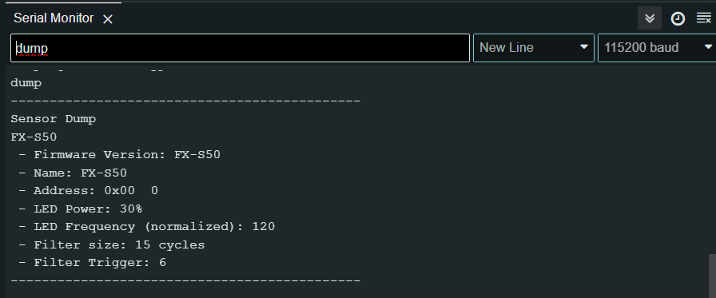

# Sensor FX-S50

*Sensor digital de obstáculos com alcance ajustavel.*

Sensor digital de obstáculos compacto, rápido e configurável. Possui duas formas de leitura: saída digital ou FoxWire (FX). Usando FoxWire é possivel conectar até 32 sensores em um unico fio, reduzindo a complexidade de conexões. A saida dital é 1 quando detecta um obstaculo e 0 quando não detecta.

<!--Além disso, o sensor possui um modo "Shell", que possibilita conectá-lo a um computador através de um conversor USB-Serial. Esse modo permite a leitura de dados e a configuração detalhada dos parâmetros.-->

**Datasheet:** [Datasheet_FXS50](../Sensor_FXS50/Datasheet_FX_S50.pdf)  
**Modelo 3D:** [Modelo 3D STEP](./SensorMini_3dmodel.step)


<iframe data-v-ad9fcaae=""
  src="https://www.youtube.com/embed/7ljwJTxrwXw?rel=0&amp;cc_lang_pref=en&amp;cc_load_policy=1"
  title="FXS50 demo"
  frameborder="0"
  allow="accelerometer; autoplay; clipboard-write; encrypted-media; gyroscope; picture-in-picture; web-share"
  referrerpolicy="strict-origin-when-cross-origin"
  allowfullscreen=""
  style="width: 100%; height: 400px;">
</iframe>
  
## Características Técnicas

| Característica         | Valor                 |
|------------------------|-----------------------|
| Tipo de sensor         | Obstaculos digital ajustavel    |
| Faixa de medição       | 0 a 50cm (*)  |
| Tensão de operação     | 3,3 a 5V      |
| Corrente de operação   | 12 a 16mA     |
| Interface de comunicação | Saida digital e pino Fox Wire |
| Dimensões                | 11,4 x 12,4 x 16,2 mm    |
| Peso        | 4,9 g  |

(*) Medição na configuração padrão. Em testes, chegou a alcançar até 70cm na configuração mais sensivel. Os resultados podem variar em função da cor, inclinação e tamanho do objeto detectado. Ajuste a sensibilidade em função da aplicação.


<!---->

### Comparação com outros sensores


## Pinagem

- Pino GND
- Pino Vcc (Alimentação de 3,3V a 5V)
- Pino S de saida digital ( HIGH detectado, LOW não detectado )
- Pino Fox Wire (Configuração e leitura)


## Lista de comandos do Shell (FX-S50 Firmware V1.4)

* `help` lista os comandos disponiveis
* `exit` encerra o shell
* `register` lê ou escreve um registrador de 8bits
* `dump` lista as principais configurações
* `vcc` mede a tensão aplicada no microcontrolador
* `reset` reinicia o sensor
* `save` salva as alterações realizadas
* `restore` restaura as configurações de fábrica
* `restore` restaura as configurações de fábrica sem alterar o endereço
* `read` lê o sensor
* `dump` lista as principais configurações
* `address` lê ou altera o endereço do sensor
* `e_freq` lê ou altera a frequência do emissor (de 0 a 255)
* `e_brightness` lê ou altera o brilho do emissor (de 0 a 100)
* `f_size` lê ou altera o comprimento do filtro (de 1 a 255)
* `f_trigger` lê ou altera o limiar de acionamento do filtro (de 1 a `f_size`)
* `aq_freq` lê ou altera a frequencia de aquisição (de 1 a 127). Recomendado 14khz. (0 significa o mais rapido possivel, mas o sinal pode ficar instavel).
* `name` lê ou altera o nome do dispositivo (até 16 caracteres)
* `uuid` lê o id único do sensor
* `scan` scaneia com varios brilhos para definir um grau de distância. parâmetro: steps, start_value, step_size, measurements, threshold [%], frequency.
* `set_digital` coloca o sensor em modo de leitura digital
* `set_analog` coloca o sensor em modo de leitura analógica
* `GPIO0` Controla as configurações do GPIO0
* `GPIO1` Controla as configurações do GPIO1

## Configuração do sensor

Este sensor é configuravel, a tabela abaixo apresenta os principais parâmetros.

| Parametros          | Descrição                 |
|---------------------|-----------------------|
| Endereço Fox Wire   | Endereço do dispositivo para o protocoolo Fox Wire     |
| Potência do Emissor | Potência do emissor, quanto maior maior o alcance. Varia de 10 a 100 |
| Frequência do Emissor | Frequência do emissor, pode ser util para ajustar o alcance ou melhorar o desempenho de sensores proximos (*). valor normalizado de 0 a 255  |
| Trig e Filter_len | Ajuste de filtragem do sinal usando um integrador e um "schmitt trigger". Quanto maior a filtragem mais limpo o sinal, porém menor a frequencia de atualização. O usuario pode fazer o ajuste fino para determinar a melhor configuração |

(*) Na deteção a longa distância a luz emitida por dois sensore um ao lado do outro a luz emitida por cada um pode causar interferencia destrutiva, reduzindo o alcalce de cada um. Usar frequências um pouco diferentes pode ajudar nisso.

### Como configurar usando o modo Shell

O modo Shell é usado para se comunicar diretamente com o sensor usando comandos de texto. Esse modo só permite a comunicação com um unico sensor por vez (Para configurar varios sensores simultaneamente use Fox Wire).

1. Conecte o sensor ao computador usando um conversor USB-Serial ou um arduino ([Conexão usando Fox Wire com Conversor USB Serial](#FxSerial)).

2. Abra algum aplicativo de comunicação Serial, como Putty ou o próprio Serial Monitor do Arduino. Configure com baudrate de 115200. No Serial Monitor pode escolher qualquer placa desde que seja a COM correta, por simplicidade selecionei um Arduino.


3. Digite "FOX-SHELL" para o sensor entrar no modo Shell. O sensor irá responder enviando "FOX-SHELL INIT!".  


4. Com o modo Shell iniciado você pode configurar o sensor ou realizar medições. Digite o comando "help" para exibir a lista de comandos disponiveis.


5. O comando "dump" exibe os valores de configuração do sensor.



<!--  > [!NOTE]  
> Highlights information that users should take into account, even when skimming.

> [!TIP]
> Optional information to help a user be more successful.

> [!CAUTION]
> Negative potential consequences of an action.

-->

> [!WARNING]  
> Conecte apenas um sensor por conexão (para configurar varios simultaneamente use FoxWire)

> [!IMPORTANT]  
> Ao final envie o comando "save" para salvar as configurações, caso contrário, ao desligar as alterações são perdidas!


## Diagrama Esquematimo

### Conexão usando Saida digital Simples


### Conexão usando Fox Wire

Repositório FoxWire: [https://github.com/luisf18/FoxWire](https://github.com/luisf18/FoxWire) 


<h3 id="FxSerial">Conexão usando Fox Wire com Conversor USB Serial</h3>


## Exemplo de código usando a saida digital simples

```c++
// Fox Dynamics Team
// Codigo simples usando a saida digital

#define SENSOR_PIN 8

void setup(){
    Serial.begin(115200);
    pinMode(SENSOR_PIN,INPUT);
}

void loop() {
    Serial.print( "Leitura do sensor: " );
    Serial.println( digitalRead(SENSOR_PIN) );
    delay(300);
}
```

---

<p align="center">
  
</p>

<!--- [Alt text](LogoFox.png) -->