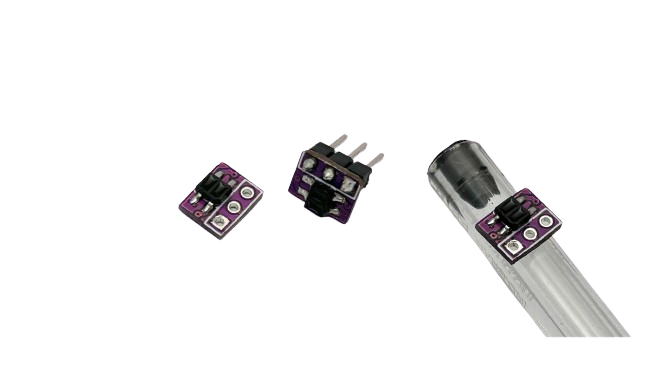

# Sensor de Linha Mini  

Pequeno sensor de linha ideal para robôs de Sumô 3kg, Mini, micro ou nano ou em seguidores de linha, principalmente como sensor de marcação lateral.



| Característica         | Valor                 |
|------------------------|-----------------------|
| Tipo de sensor         | Sensor de linha analógico  |
| Tensão de operação     | 3,3 a 5V      |
| Dimensões                | 8 x 6,5 x 3,3 mm    |
| Peso        | 0,15 g  |

## Exemplo de código

```c++

// Fox Dynamics Team
// Codigo simples de leitura do sensor de linha

#define SENSOR_PIN   8
#define SENSOR_TRIG  600 // valor de transição de uma cor para outra

void setup(){
    Serial.begin(115200);
    pinMode(SENSOR_PIN,INPUT);
}

void loop() {
    int an = analogRead(SENSOR_PIN);
    Serial.print( "Leitura do sensor: " );
    Serial.print( an );
    Serial.print( " Cor: " );
    Serial.println( an < SENSOR_TRIG ? "Branco" : "Preto" );
    delay(300);
}
```

---

<p align="center">
  
</p>