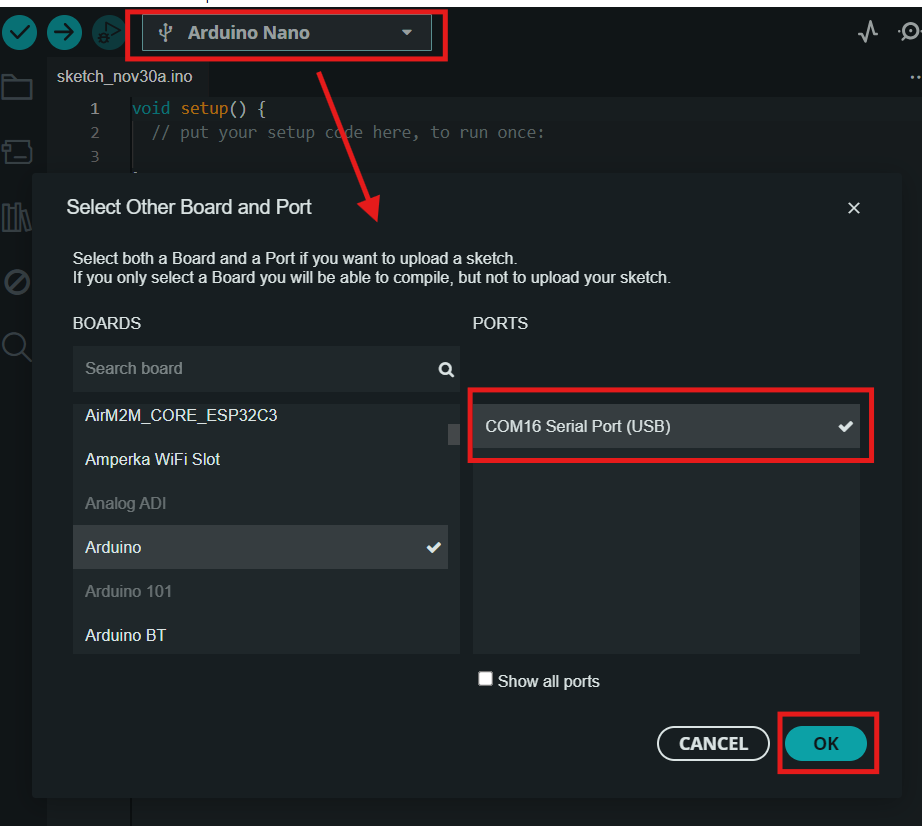
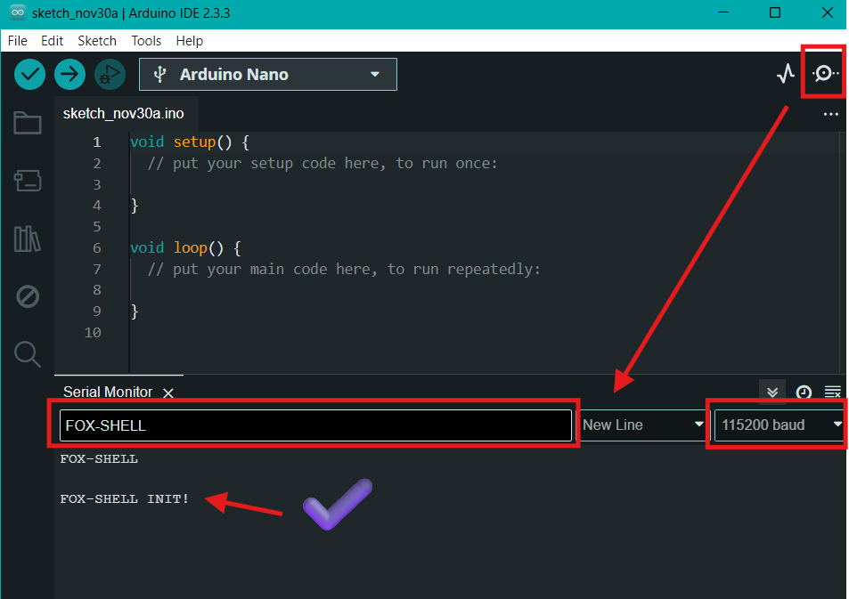
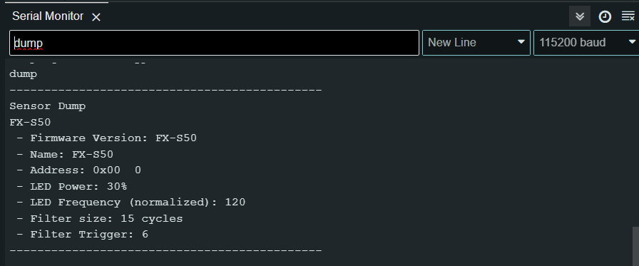
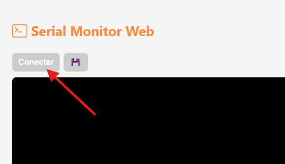
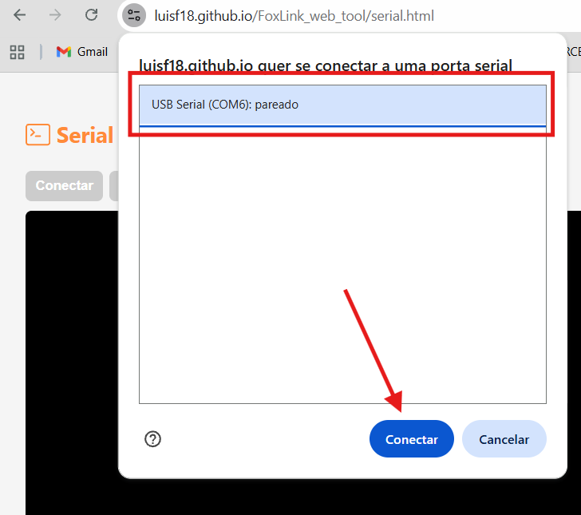
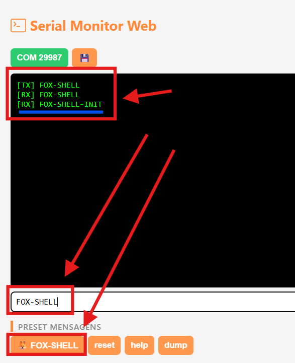

# Shell

O modo **Shell** permite realizar leituras e configurações através de comandos de texto.
Ele pode ser utilizado em qualquer aplicativo de comunicação serial, como:

* **Arduino IDE** (Serial Monitor)
* **Putty**
* [**Fox Serial**](https://luisf18.github.io/FoxLink_web_tool/serial.html)

---

## 🔌 Conexão

Para conectar um dispositivo ao computador, é necessário utilizar um **FoxLink**.
Veja mais detalhes em: [**FoxLink**](../../../foxlink)

---

## Iniciando e utilizando o modo Shell

1. Conecte o dispositivo ao computador usando um **FoxLink**

2. Abra um software de comunicação serial (Arduino IDE, Putty ou Fox Serial)

3. Selecione a porta COM do FoxLink

4. Configure:

   * Baudrate: **115200**
   * Final de linha: **NL + CR**

5. Envie o comando:

```
FOX-SHELL
```

O dispositivo deve responder com:

```
FOX-SHELL-INIT!
```

6. Após a inicialização, utilize:

   * `help` — para listar os comandos disponíveis
   * `dump` — para visualizar as configurações atuais

7. ⚠️ **Antes de sair, salve as alterações:**

```
save
```

8. Finalize o modo Shell com:

```
exit
```
----

## Comandos

A lista de comandos varia de acordo com cada dispositivo, mas todos possuem os comandos básicos abaixo:

* `FOX-SHELL` — inicia o modo Shell
* `help` — lista os comandos disponíveis
* `exit` — encerra o shell
* `dump` — exibe as principais configurações
* `reset` — reinicia o dispositivo
* `uuid` — lê o identificador único
* `save` — salva as alterações realizadas
* `address` — lê ou altera o endereço **FoxWire**
* `register` — lê ou escreve um registrador de 8 bits
* `vcc` — mede a tensão interna
* `restore` — restaura configurações de fábrica
* `restore_keep_addr` — restaura sem alterar o endereço

---

## Inicialização condicional (Redes com multiplos dispositivos)

Em redes com múltiplos dispositivos, é necessário especificar com qual dispositivo deseja se comunicar.

Por padrão, o comando:

```
FOX-SHELL
```

inicia **todos os dispositivos na linha**.
Isso só é seguro quando há **apenas um dispositivo conectado** — caso contrário, podem ocorrer conflitos de comunicação.

Para resolver isso, utilize os modos de **inicialização condicional**:

* `FOX-SHELL` — inicia todos os dispositivos (**usar apenas com um dispositivo**)
* `FOX-SHELL-<ADDR>` — inicia um dispositivo específico pelo endereço
* `FOX-SHELL-IF` — inicia apenas o dispositivo que atende a uma condição específica
* `FOX-SHELL-UNLOCK` — desbloqueia os dispositivos para permitir nova comunicação

---

### ⚠️ Importante

* O modo **Shell** permite comunicação com **um dispositivo por vez**.
* Em redes com múltiplos dispositivos, utilize sempre a inicialização condicional para evitar conflitos.
* Para configurar vários dispositivos simultaneamente, utilize o **FoxLink WebTool**.

---

### Exemplo

```text
FOX-SHELL-0
<comandos>
exit
FOX-SHELL-UNLOCK
FOX-SHELL-1
<comandos>
exit
```
---

## Shell com Arduino IDE








---

## Shell com Fox Serial

1\. Acesse:
   [https://luisf18.github.io/FoxLink_web_tool/serial.html](https://luisf18.github.io/FoxLink_web_tool/serial.html)

2\. Clique em conectar

<p align="center">
  
</p>

3\. Escolha a serial do **FoxLink**

<p align="center">
  
</p>

4\. Clique em **FOX-SHELL** ou digite o comando manualmente

<p align="center">
  
</p>

<!--
# Shell

O modo shell modo **Shell** utiliza comandos de texto para realizar leituras e configurações, rodando em qualquer aplicativo de comunicação serial, como **Arduino IDE** com Serial monitor, **Putty** ou [**Fox Serial**](https://luisf18.github.io/FoxLink_web_tool/serial.html).

A lista de comandos depende de cada dispositivo. No entanto, existem [comandos comuns a todos](#comandos-comuns-a-todos-os-dispositivos).

Para conectar um dispositivo ao computador é preciso de ter um **FoxLink** acesse para mais informações [**FoxLink**](../../../foxlink).

Para iniciar o modo shell envie **"FOX-SHELL"**. ele deve responder com **"FOX-SHELL INIT!"**.Em seguida digite os comandos que desejar.

⚠️ **IMPORTANTE:**  
1. O modo **Shell** só funciona com um dispositivo conectado ao **FoxLink** por vez. (para configurar varios simultaneamente use **FoxLink WebTool**).  
2. Ao terminar de configurar envie o comando **"save"** para salvar as alterações, caso contrário, ao desligar as alterações são perdidas!  

## Comandos comuns a todos os dispositivos

Todos os dispositivos Fox posssuem os comandos a seguir.

* `FOX-SHELL` inica o modo Shell
* `help` lista os comandos disponíveis
* `exit` encerra o shell
* `dump` lista as principais configurações
* `reset` reinicia o dispositivo
* `uuid` lê o id único
* `save` salva as alterações realizadas
* `address` lê ou altera o endereço **FoxWire** do dispositivo
* `register` lê ou escreve um registrador de 8 bits
* `vcc` mede a tensão interna
* `restore` restaura as configurações de fábrica
* `restore_keep_addr` restaura as configurações de fábrica sem alterar o endereço

### Inicialização condicinal

Como o shell é executado em uma linha que pode possuir diversos dispositivos ligados em paralelo, é preciso especificar com qual dispositivo deseja se comunicar. O comando **FOX-SHELL** inicia todos na linha, se houver mais de um dispositivo isso irá causar erros. A **inicialização condicional** é um recurso que ajuda a distinguir o dispositivo destino. A seguir os comando de inicialização e suas diferenças.

* `FOX-SHELL` inicia todos os dispositivos em modo shell (só pode ser feito quando só tem um dispositivo!)
* `FOX-SHELL-<ADDR>`  inicia o dispositivo com o endereço correspondente
* `FOX-SHELL-IF` inicia apenas o dispositivo que atende a uma condição especifica. Por exemplo, no sensor FXS50, a condição é ter um obstaculo na frente. Portanto, para acionar apenas um dispositivo com endereço indefinido coloque um obstaculo na frente de um unico sensor e execute este comando.
* `FOX-SHELL-UNLOCK` Os dispositivos na linha que não são iniciados entram em modo de espera. Para iniciar comunicação posteriormente com outro dispositivo é preciso sair e executar esse comando.

**Exemplo:**

Iniciando Shell no dispositivo 0, saindo e depois iniciando o 1 em uma rede com 2 ou mais dispositivos:

1. `FOX-SHELL-0` (inicia 0 e bloqueia os outros)
2. "comandos..."
3. `exit` (encerra 0)
4. `FOX-SHELL-UNLOCK` (desbloqueia todos)
5. `FOX-SHELL-1` (inicia 1 e bloqueia os outros)
6. "comandos..."
7. `exit`

## Passo a passo

1. Conecte o dispositivo ao computador usando um **FoxLink**;  
2. Abra algum aplicativo de comunicação Serial, como **Arduino IDE** + **Serial monitor**, **Putty** ou [**Fox Serial**](https://luisf18.github.io/FoxLink_web_tool/serial.html);  
3. Selecione a COM do  **FoxLink**;  
4. Configure o baudrate para 115200 e "\n"+"\r" ao final ou "NL & CR" (no Arduino);  
5. Envie **"FOX-SHELL"** para o sensor entrar no modo Shell. O sensor irá responder enviando **"FOX-SHELL-INIT!"**.  
6. Com o modo Shell iniciado você pode configurar o sensor ou realizar medições. Digite o comando "help" para exibir a lista de comandos disponiveis.  
7. O comando "dump" exibe os valores de configuração do sensor.  
8. Ao terminar feche o shell usando `exit`.  


## Arduino IDE


## Fox Serial

1. Acesse [https://luisf18.github.io/FoxLink_web_tool/serial.html](https://luisf18.github.io/FoxLink_web_tool/serial.html).  
  
2. Clique em conectar  
<p></p>
   
    
3. Escolha a serial do **FoxLink**  
<p></p>
     
     
4. Clique no botão **FOX-SHELL** ou digite **FOX-SHELL** e envie clicando enter. Ele deve responder com **FOX-SHELL-INIT**
<p></p>

-->