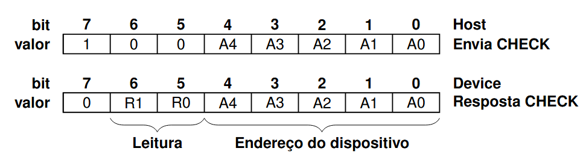

# FoxWire

O protocolo FoxWire foi projetado para prover comunicação rápida e confiavel com multiplos dispositivos através de um unico fio. Ele pode ser implementado em Hardware ou em Software em praticamente qualquer microcontrolador.

Ele usa o protocolo UART 8N1 com baudrate de 115200, enquanto um dispositivo envia bytes os outros escutam. O protocolo funciona com um Host (Mestre) iniciando a comunicação, ele envia um pacote de um ou mais bytes que identifica o dispositivo e o modo de conexão.

Exitem 4 tipos de pacotes de inicialização, que indicam a quantidade de bytes sequintes e o objetivo da comunicação.

* **Pacote Status:** Pacote de apenas 1 byte, que aguarda que o dispositivo destino responda com 1 byte de confirmação
* **Pacote Read:** Pacote de 2 bytes, que aguarda que o dispositivo destino responda com 1 byte de resposta
* **Pacote Write:** Pacote de 3 bytes, que aguarda que o dispositivo destino responda com 1 byte de resposta
* **Pacote Estendido:** Pacote com mais de 3 bytes

### Header dos Pacotes

o header possui 1 byte

* **bit 7 MSB:** 1 (indica que é um pacote Header)
* **bit 5-6:** tipo de pacote (0, 1, 2 ou 3)
* **bit 0-4:** Endereço do dispositivo destino

### Pacote status

### Pacote read

### Pacote write

### Pacote estendido

