# Fox Nano V0

Placa compacta totalmente compativel com Arduino Nano só que com suporte pra display OLED, medição de VIN e Receptor IR integrados. Com ela é possivel fazer uma interface homem maquina (IHM) completa, usando o display como saida e a recepção IR como entrada, onde o ususário pode inserir valores e dar comandos usando um controle remoto IR. Ela também é especialente interessante pra projetos de seguidores de linha e Mini Sumo.

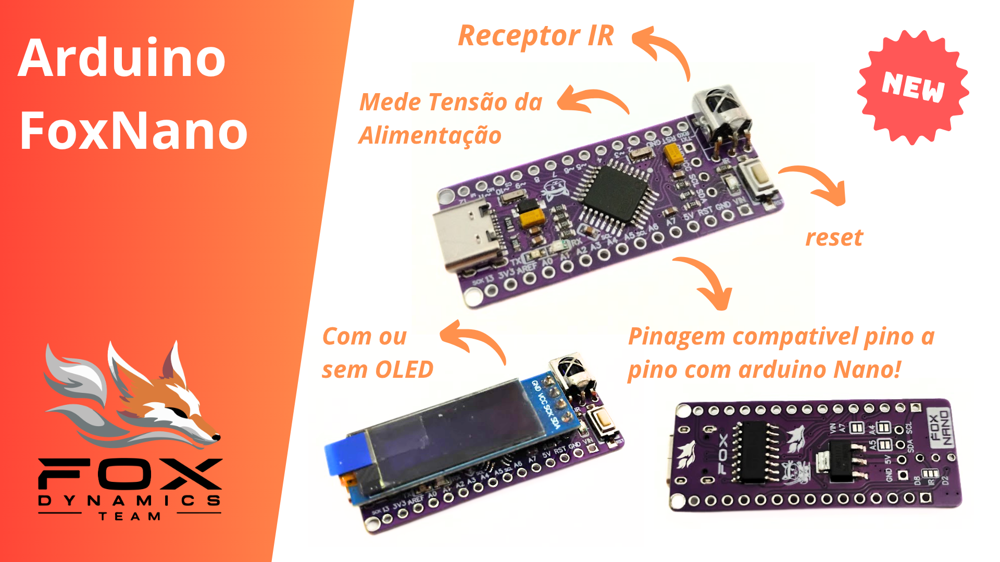

## Pinout
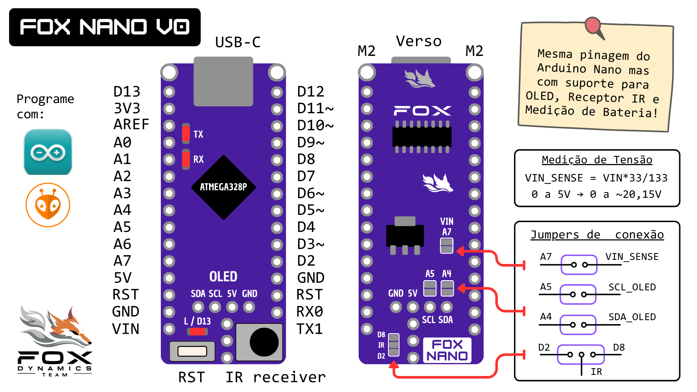

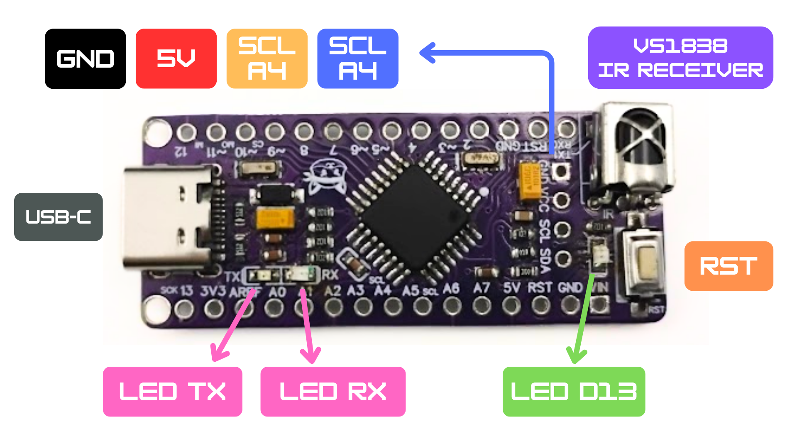

## Caracteristicas

| Parametro | valor |
|--|--|
| Medidas | 45,2 x 28,7 mm |
| Medidas + USB | 46,2 x 28,7 mm |
| Alimentação | 6 a 12V |
| Peso sem OLED | 3,5g |
| Peso com OLED | 6,0g |

## Medidas

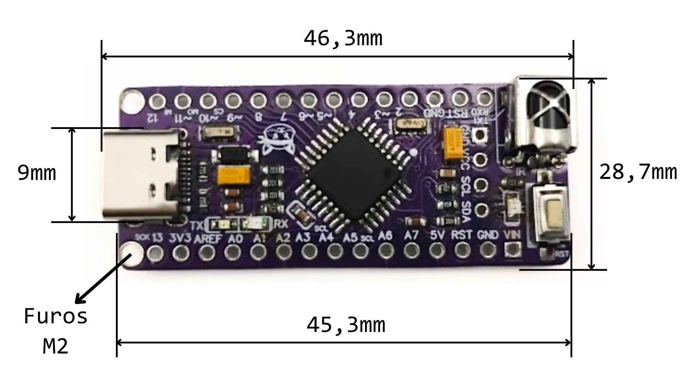

## Programação usando Arduino

A `FoxNano` é totalmente compativel com o Arduino nano, por isso ele pode ser programada selecionando a placa `Arduino nano` na IDE do Arduino. Todos os exemplos para Arduino nano irão Funciona com a `FoxNano`.

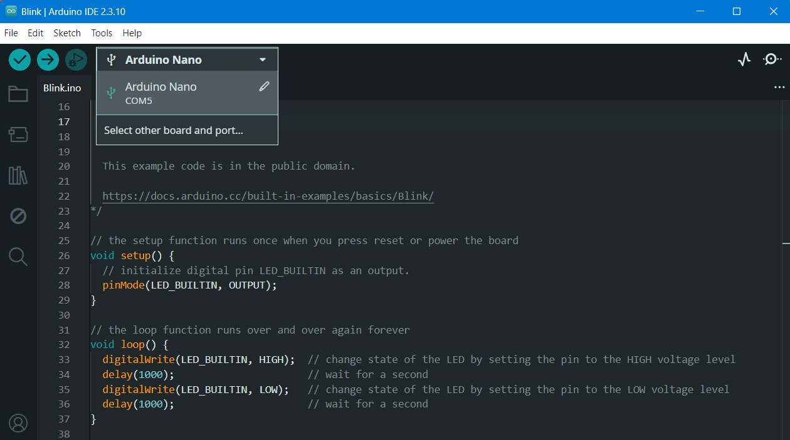

## Receptor IR

A `FoxNano` possui um receptor IR que pode ser soldado ao pino D2, D8 ou até deixar desconectado. A seleção é feita no jumper `IR` conforme a legenda.

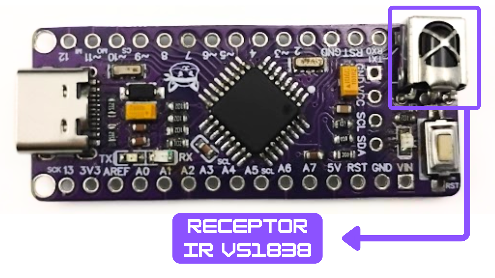

Jumper IR

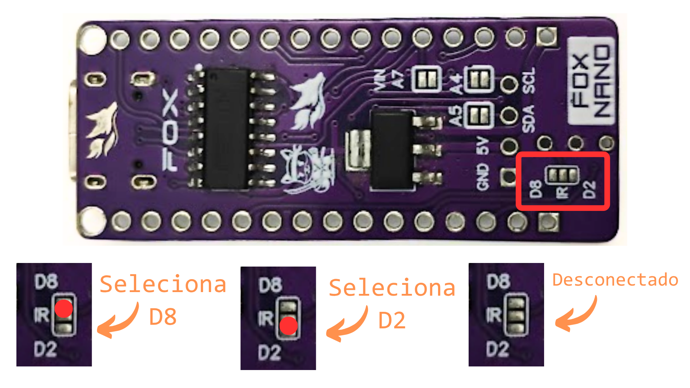

## Medição de Tensão de VIN

A `FoxNano` possui um divisor de tensão conectado ao pino de alimentação externa `VIN`. A saida do divisor pode ser conectado ao pino A7 para medição de tensão. O divisor é composto por um resistor de 100 Kohms conectado de `VIN` pra `V_SENSE` e outro de 33 Kohms de `V_SENSE` para `GND`.

Formula: 

```
V_SENSER = VIN * 33/133
```

No código pode ser lido usando a função abaixo: 

``` c
float readVin(){
    return analogRead(A7)*(5.0/1024.0)*(133.0/33.0);
}
```

Jumper:

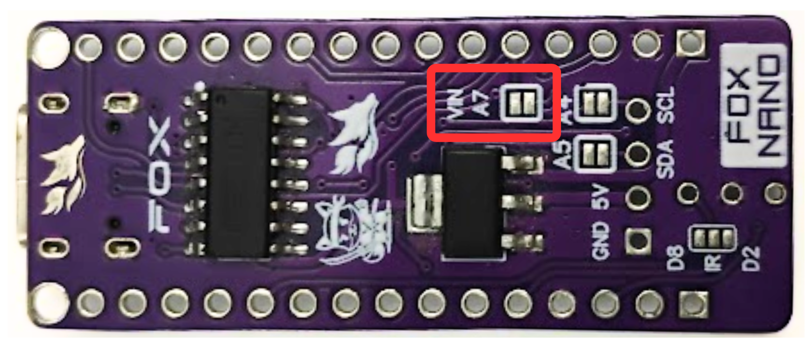

## Saida I2C e Display OLED

A `FoxNano` possui uma saida I2C conectada aos pinos A4 e A5. Nela é possivel conectar um display OLED.

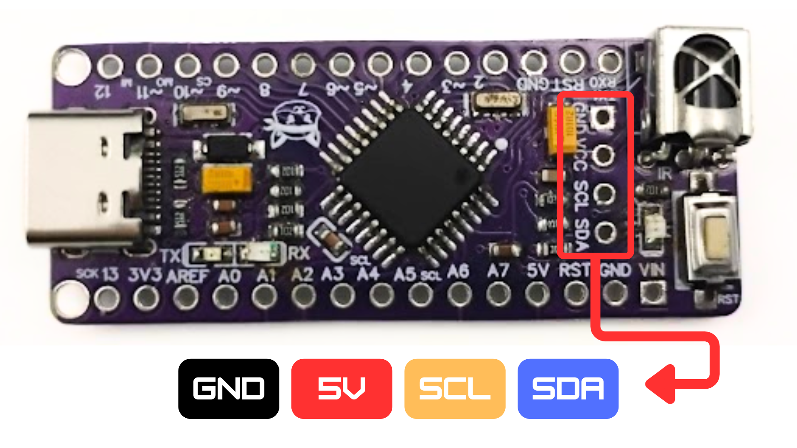

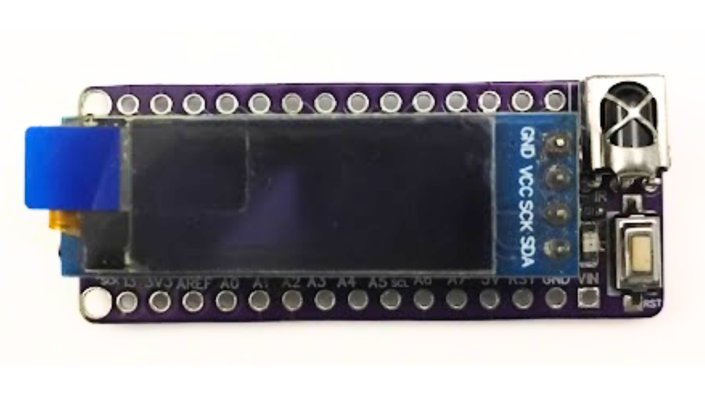

### Jumpers A4 e A5

Os pinos A4 (SDA) e A5 (SCL) podem ser desconectados da saida I2C disoldando os jumpers de solda `A4` e `A5` no verso da placa. Isso é util quando o OLED está soldado mas é preciso usar a placa em algum projeto que use os pinos A4 e A5 para outras funções, assim, não será possivel usar o OLED mas não precisa disoldar ele.

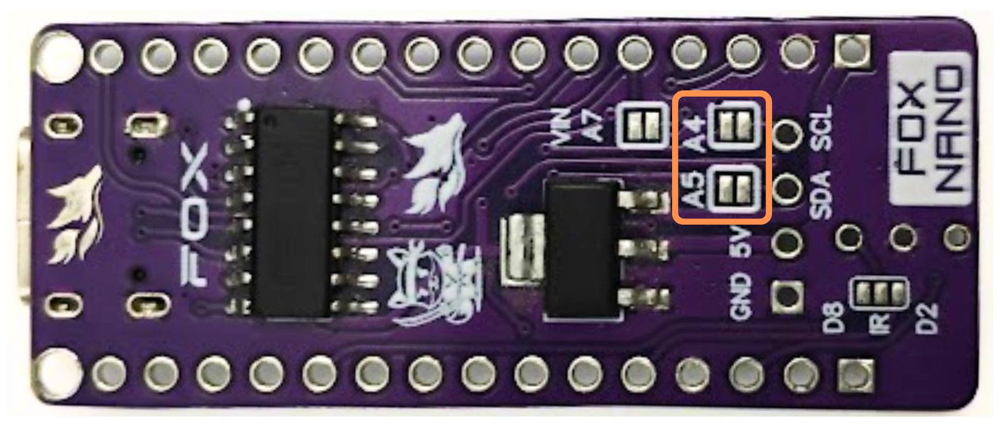

### Outras possibilidade para saida I2C

Os pinos podem ser usado pra outras funções como conectar um servo ou sensor analogico. Na imagem abaixo um exemplo usamdo um servo.

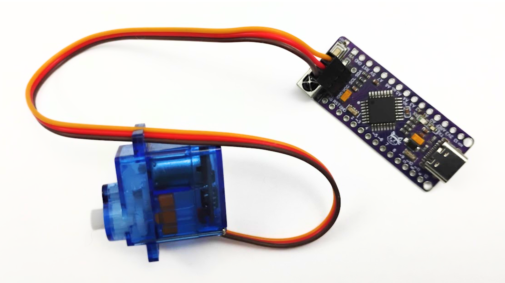

Também é possivel conectar um display OLED maior.

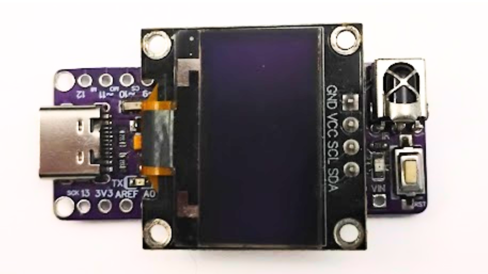


