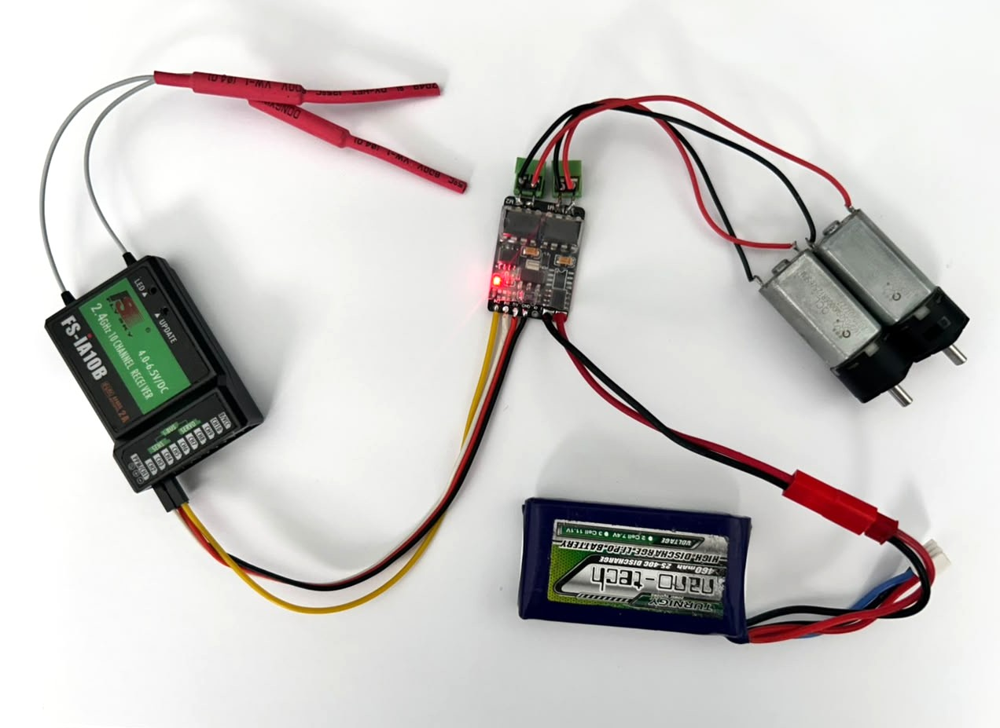
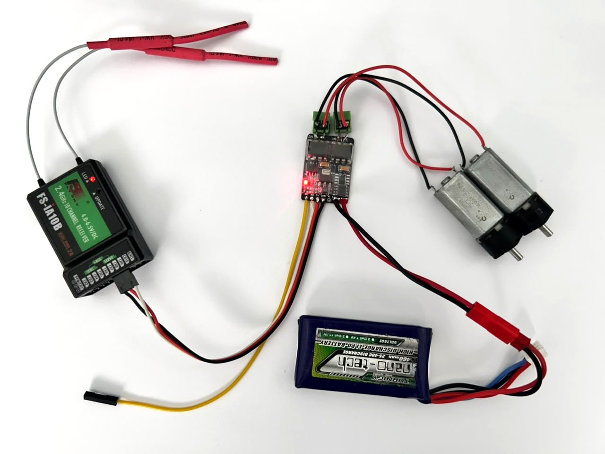
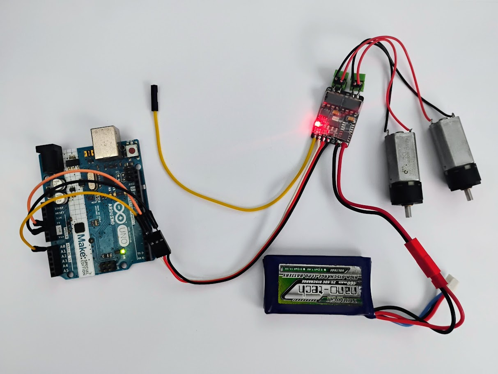
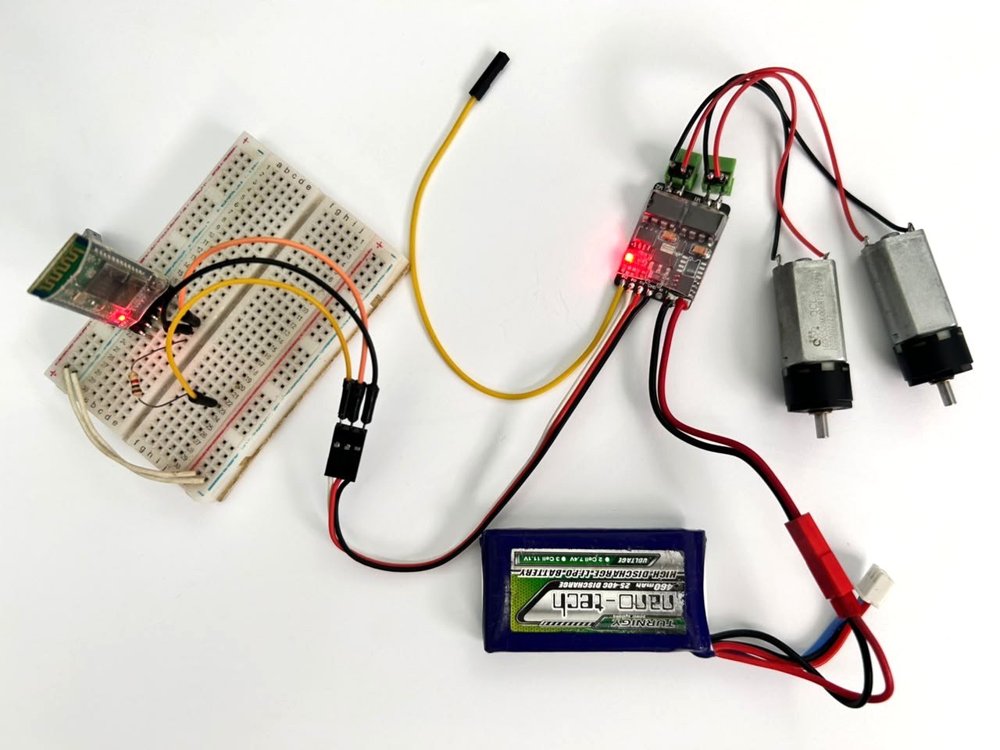
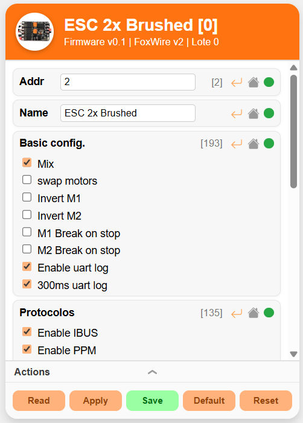
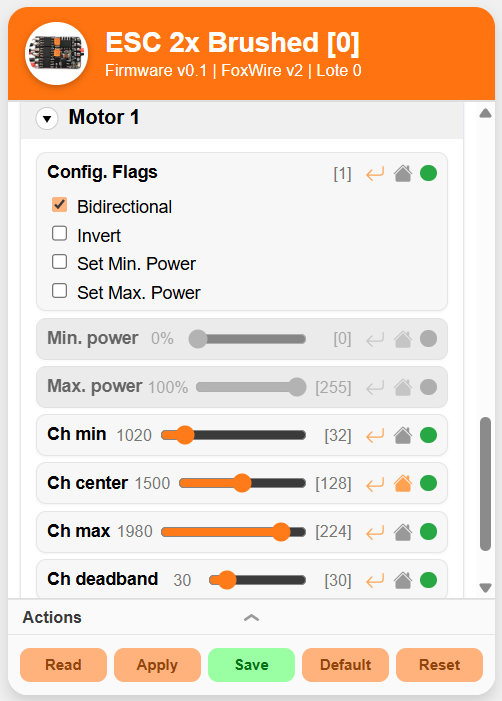
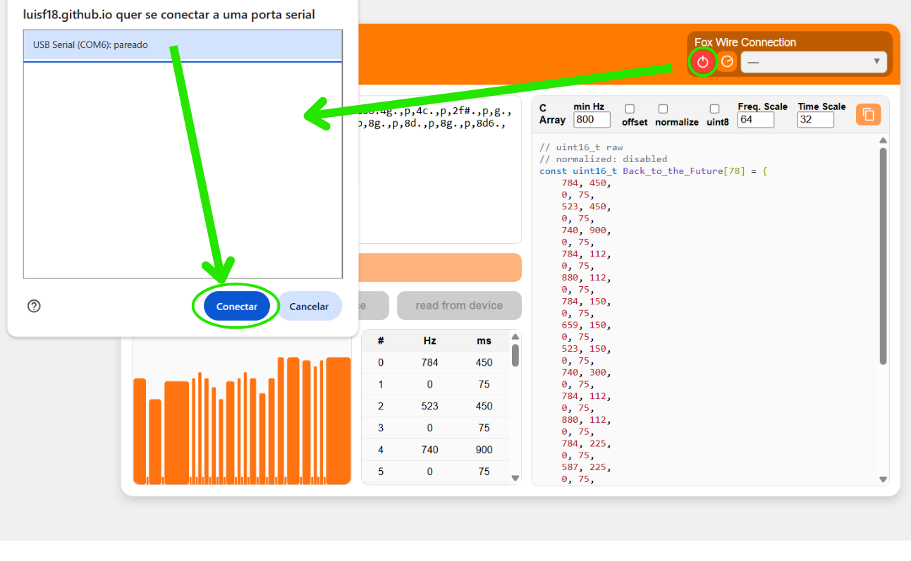
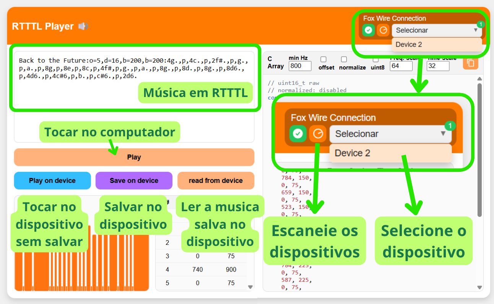

# ESCs brushed duplo

*ESCs para dois motores escovados multiprotocolo, configuravel e com música.*

## Características Técnicas

| Modelo | Tensão | Bateria | Corrente | BEC |
|----|-----|----|----|----|
| ESC Brushed 2 x 1.5A  | 6V até 10V | 2S | até 1.5A por motor | 5V 500mA |
| ESC Brushed 2 x 3A    | 6V até 15V | 2 a 3S | até 3A por motor | 5V 200mA |
| ESC Brushed 2 x 5A    | 6V até 14V | 2 a 3S | até 5A por motor | 5V 500mA |

## ESC 2x5A Brushed

## ESC 2x3A Brushed

## ESC 2x1.5A Brushed

## Protocolos e compatibilidade

- Sinal PWM de servo
- PPM
- IBUS
- FoxWire
- UART (Módulos Bluetooth também)

## Sinal PWM de servo

**Canal 1:** Sinal de sero PWM 1  
**Canal 2:** Sinal de sero PWM 2  

## Sinal IBUS

**Canal 1:** Sinal IBUS  
**Canal 2:** Telemetria UART TX com baudrate de 115200 (se não quiser não precisa usar)  

## Sinal PPM

**Canal 1:** Sinal PPM  
**Canal 2:** Telemetria UART TX com baudrate de 115200 (se não quiser não precisa usar)  

<!---->

## Controle via UART

**Baudrate:** 115200  
**Canal 1:** RX / TX  
**Canal 2:** TX (Telemetria ou respostas, se não quiser não precisa usar)  

## Com HC-05 e outros modulos Bluetooth

**Baudrate:** 115200  
**Canal 1:** RX / TX  
**Canal 2:** TX (Telemetria ou respostas, se não quiser não precisa usar)  

## Comandos shell

O modo shell permite ler e alterar parâmetro e controlar a placa via comandos de texto enviados em UART com baundrate 115200. Ideal para integrar com projetos usando Arduino, ESP32 ou Raspbarry pi.

**Funcionamento:** cada vez que um comando de movimento é recebido o ESC executa o movimento e reinicia o contador de tempo do mecanismo de failsafe. Caso ultrapasse o tempo determinado pelo parâmetro "uart_failsafe" o esc desliga os motores.

**uart_failsafe:** O parametro uart failsafe é diferente do failsafe geral usado pelos outros protocolos. ele pode ser ajustado de 0 a 2000 ms. Caso ele seja igual a zero ele é desativado, ou seja, o mecanismo de failsafe não desliga os motores se parar de receber comandos.

**Sintaxe:** Existem duas formas de usar o modo uart.  
- **Acionando o modo Shell**: toda vez que o reiniciar a placa pra iniciar a comunicação deve acionar o modo shell enviando "FOX-SHELL" em seguida ele deve responder com "FOX-SHELL-INIT" informando assim que iniciou. Depois basta enviar qualquer comando da tabela que ele irá aceita.   
- **Modo Bluetooth (por prefixo)**: Envie "FX-" seguido pelo comando, por exemplo: "FX-pwm -2000 2000" ou "FX-stop". Dessa forma dispenssa inicialização com "FOX-SHELL" no entanto é necessário que a opção "BLUETOOTH" esteja habilitada no campo de **protocolos** da configuração. Existe ainda a variação "FX0-...". Ao colocar 0 informa que a resposta ao comando deve ser enviado no mesmo fio, enquanto "FX-" ele responde no outro pino de canal.

|Comandos| uart_failsafe | Função |
|---|--|--|
| FOX-SHELL | não muda | Inicia a comunicação em modo shell |
| move `v1` `v2` `t` | não muda | Movimenta os motores com as velocidade `v1` e `v2` (de -2000 a 2000) durante `t` milisegundos depois para os motores. |
| move_ch `ch1` `ch2` `t` | não muda | Movimenta os motores com as velocidade usando `ch1` e `ch2` (de 1000 a 2000) como entradas de canais durante `t` milisegundos depois para os motores. |
| off | reinicia | Desliga os motores |
| stop | reinicia | Freia os motores |
| fall | encerra | Encerra a conexão |
| ch `ch1` `ch2` ... | reinicia | Envia o valor de cada canal |
| pwm `v1` `v2` | reinicia | Envia o valor pwm de cada motor de -2000 a 2000 |
| uart_failsafe `t` | configura | Lê ou escreve o valor do failsafe da uart de 0 a 2000 ms |
| sound `n` | não muda | toca a musica de indice `n` **0:** Init **1:** Connect **2:** Disconnect **3:** Beacon **4:** Extra |
| beep `f_Hz` `count` `periode` `motor` | não muda | toca um beep de frequência (`f_Hz`) durante `periode` milisegundos depois desliga durante o mesmo intervalo e repete isso `count` vezes no `motor` (se quiser tocar os dois deixe sem esse parâmetro). **Exemplo:** "pi... pi... pi..." seria: *beep 2000 3 200*  |
| load | não muda | Carrega as configuração. Use caso altere elas ou reinicie o ESC. |
| uart1 `texto` | não muda | Imprime `texto` no pino de telemetria se ele estiver disponivel. |
| [*comandos padrão*](../../communication/Shell) | - | Mais informações em [Shell](../../communication/Shell) |

## Configuração

### Parâmetros gerais

| Parametros | Descrição |
|--|--|
|**Addr**| Endereço no protocolo FoxWire (de 0 a 31) |
|**Name**| Nome do dispositivo (até 16 caracteres) |
| **Basic config.** | - **Mix:** mixar os canais    - **swap motors:** troca as entradas de motores  - **Invert M1** inverte o sentido de M1  - **Invert M2** inverte o sentido de M2  - **M1 Break on stop** Aciona freio de M1  - **M2 Break on stop** Aciona freio de M2  - **Enable uart log** Aciona log no pino de canal ocioso  - **300ms uart log** Limita a 300ms o intervalor entre logs (recomendado) |
|**Protocolos** | Habilita os protocolos: IBUS, PPM e "Bluetooth" (comandos uart com "FX-" ou "FX0-") |
| **Failsafe delay** | Tempo de failsafe em milisegundos |
| **UART Failsafe** | Tempo de failsafe em milisegundos dos comandos de movimento via uart |
|**Sound Volume**| Volume do durante execução de musicas. **[Atenção]:** Se colocar um valor muito grande o motor prode acabar girando ao tocar a musica.  - **Sound On**: aciona sons  - **Automatic volume compensation**: Compensação automatica do volume em função da frequencia  |
|**Sounds config.**| - **Enable start sound**: Habilita musica ao ligar o ESC  - **Enable connect sound**: Habilita musica ao conectar  - **Enable disconnect sound**: Habilita musica ao perder conexão  - **Use default sounds**: Caso habilitado usa os sons padrão caso contrário usa os sons inseridos pelo usuario |
|**Multi Channels**| Nos casos de protocolos que forncem o valor de varios canais em um unico fio (como: IBUS, PPM ou UART) o ESC usa essa tabela para saber a função de cada canal. Caso um canal não seja usado coloque "--".  - **In1/rotation** entrada 1 ou velocidade de rotação quando está mixado.  - **In2/speed** entrada 2 ou velocidade linear quando está mixado.  - **Flip** canal pra inverter o sentido de IN2: util pra caso o robô esteja de cabeça pra baixo  - **Max speed** canal que controla a velocidade maxima dos motores  - **Sound** Canal pra colocar um switch, quando acionado começa a tocar uma musica definida pelo usuario.  - **Move1** Quando acionado o esc executa o movimento 1 programdo pelo usuário.  - **Move2** Quando acionado o esc executa o movimento 2 programdo pelo usuário. |

### Configurações de cada motor

| Parametros | Descrição |
|--|--|
|**Config. Flags**|  - **Bidirectional** se o motor é bidirecional ou não.  - **Invert** Inverte o sentido do motor.  - **Set Min. Power** habilita a limitação de potência minima nos motores usando o parametro **Min. Power**  - **Set Min. Power** habilita a limitação de potência maxima nos motores usando o parametro **Max. Power**  |
|**Min. power**| Valor minimo de PWM que o motor irá receber. De 0 a 100%. Recomendado para remover a zona morta onde um PWM muito baixo não suficiente para mover o motor. |
|**Ch min**| Valor minimo do canal de entrada. |
|**Ch center**| Valor central do canal de entrada. Nele o motor esta parado ou em freio. |
|**Ch max**| Valor máximo do canal de entrada. |
|**Ch deadband**| Zona de tolerância em torno do centro e dos limites do canal de entrada. Por exemplo: para o motor começar a se mover, o canal de entrada precisa ser maior que **Ch max** + **Ch deadband**. |

## Ajustando Musica de inicio

Altere ou leia a musica de inicio do ESC usando a ferramenta de [upload de musicas](https://luisf18.github.io/FoxLink_web_tool/rtttl.html). A ferramenta aceita melodias em formato RTTTL.

**Passo 1:** Conecte a placa com a ferramenta.  

**Passo 2:** Clique em escanear e selecione o dispositivo.  
**Passo 3:** Toque no computador ou no dispositivo ou salve musicas em RTTTL.  

  