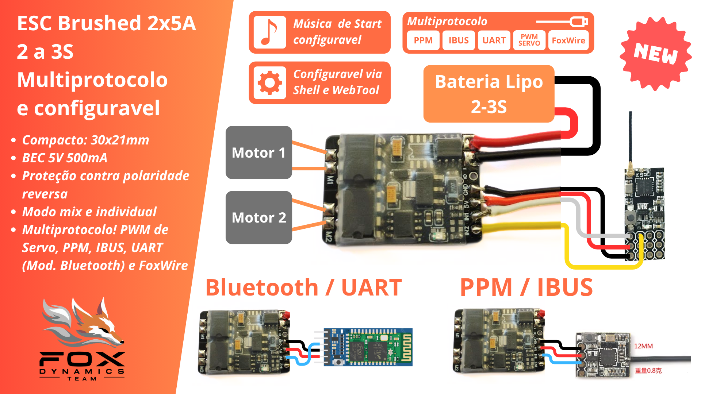
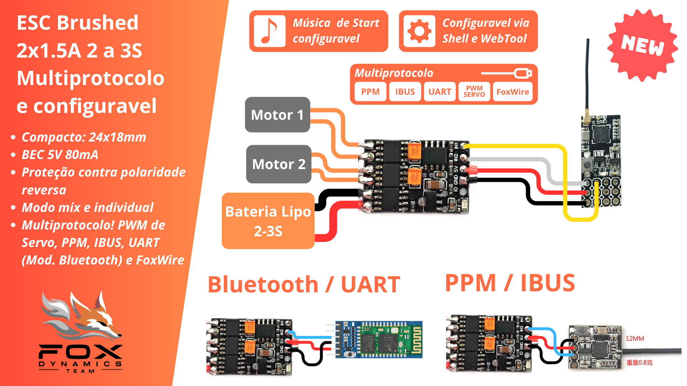
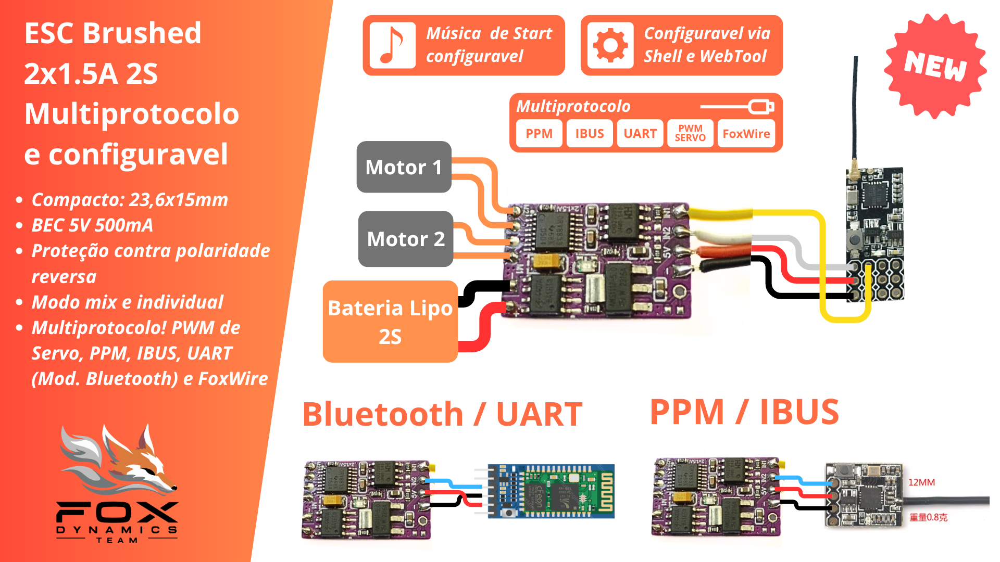

# ESCs brushed duplo

*aviso: Documentação em desenvolvimento.*

*ESCs para dois motores escovados multiprotocolo, configuravel e com música.*

...

## Características Técnicas

| Modelo | Tensão | Bateria | Corrente | BEC |
|----|-----|----|----|----|
| ESC Brushed 2 x 1.5A  | 6V até 10V | 2S | até 1.5A por motor | 5V 500mA |
| ESC Brushed 2 x 3A    | 6V até 15V | 2 a 3S | até 3A por motor | 5V 200mA |
| ESC Brushed 2 x 5A    | 6V até 14V | 2 a 3S | até 5A por motor | 5V 500mA |

## ESC 2x5A Brushed

## ESC 2x3A Brushed

## ESC 2x1.5A Brushed

## Protocolos e compatibilidade

- Sinal PWM de servo
- PPM
- IBUS
- FoxWire
- UART (Módulos Bluetooth também)

