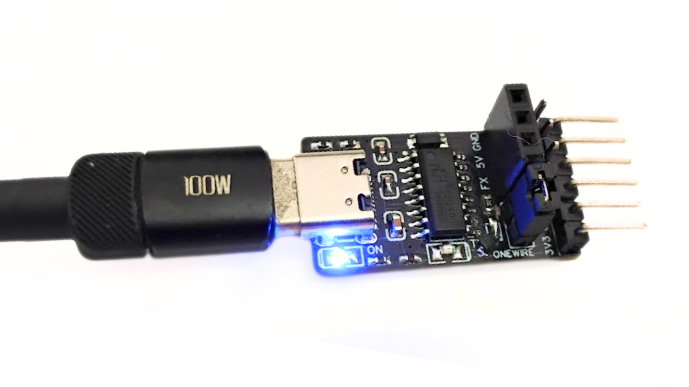
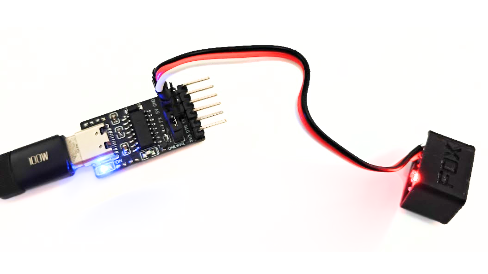
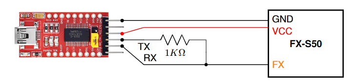
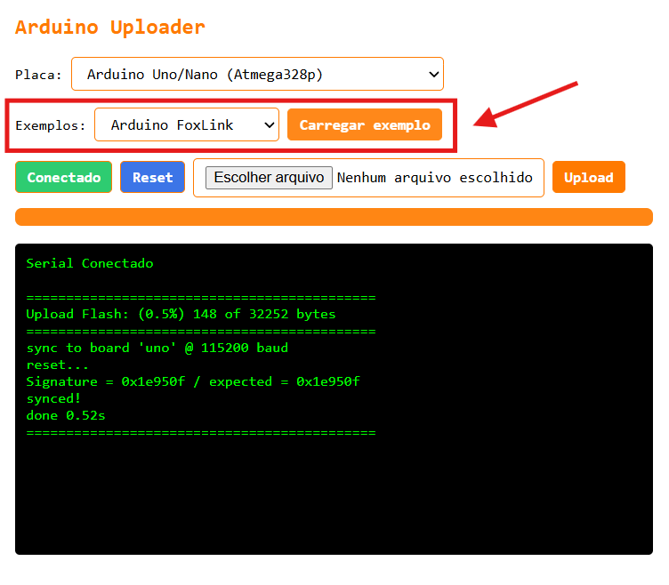
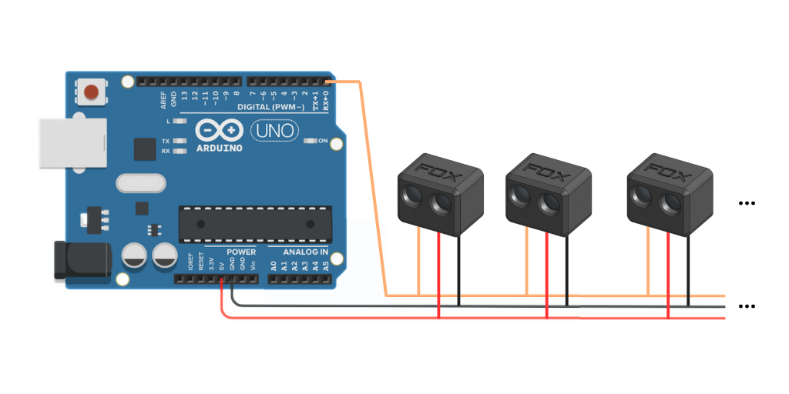

# FoxLink

Um FoxLink é a placa que possibilita a comunicação entre o computador e os dispositivos da Fox. É recomendado usar o FoxLink oficial mas também é possovel montar. A seguir as alternativas.

## [Opção 1] FoxLink oficial (recomendado) ⭐️

A Fox fornece um FoxLink oficial multiprotocolo. Ele é 4 em 1, funciona com dispositivos Fox (FoxWire/FoxShell), ESCs BLHeli e AM32 e também pode ser usando como conversor USB serial. O uso é simples, basta conectar o dispositivo nos primeiros 3 pinos (conforme a imagem). Obs: no modo foxlink, am32 e BlHeli o jumper precisa estar conectado.




## [Opção 2] FoxLink usando um conversor USB Serial

Conecte o TX da placa com o RX usando um resistor de 1Kohm. O pino RX será o pino de comunicação (Pino FX) que deverá ser conectado aos sensores.



## [Opção 3] FoxLink usando Arduino Nano ou UNO

Outra opção é usar um **Arduino Nano** ou **UNO** como interface entre o computador e os dispositivos Fox. No entanto, a comunicação não é tão estavel como usando um conversor USB Serial ou FoxLink oficial. Por isso, se for usar, teste mais de uma vez se as configurações de fato foram salvas.

### Código FoxLink bitwise ASM

Abra o Arduino IDE ou o [**Arduino uploader**](https://luisf18.github.io/FoxLink_web_tool/uploader), faça upload do código abaixo, em seguida conecte o pino de sinal do sensor, "FX", ao pino 0 também conhecido como "RX".

✅ _A versão atual melhorou significativamente o desempenho._

```c++
// Fox Dynamics Team
// FoxLink bitwise ASM V0.2
#include <avr/io.h>

int main() {
  DDRD = (1 << PD1);
  PORTD = (1 << PD0);
  while (1) {
      asm volatile (
          "in r0, %[pin]" "\n\t"
          "bst r0, 0" "\n\t"
          "bld r0, 1" "\n\t"
          "out %[port], r0" "\n\t"
          :
          : [pin] "I" (_SFR_IO_ADDR(PIND)),
            [port] "I" (_SFR_IO_ADDR(PORTD))
          : "r0"
      );
  }
}
```

### Alternativa para fazer upload online sem o Arduino IDE

A Fox disponibiliza uma ferramenta de upload de binarios ja compilados para Arduino o [**Arduino uploader**](https://luisf18.github.io/FoxLink_web_tool/uploader). Para carregar o código do **Arduino Foxlink** acesse o [**Arduino uploader**](https://luisf18.github.io/FoxLink_web_tool/uploader), escolha e conecte a placa, depois selecione o exemplo **Arduino Foxlink** e clique em **Carregar exemplo**. O codigo será instalado e a placa ja estará pronta para uso com o [**FoxLink webtool**](https://luisf18.github.io/FoxLink_web_tool)




