# Fox Dynamics

## Sensores

| [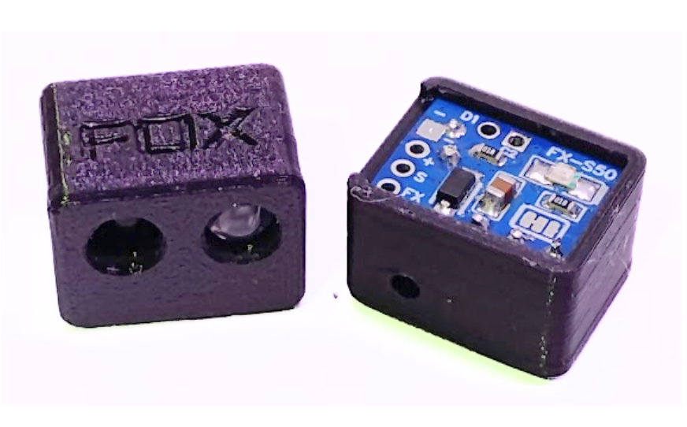](Sensores/fxs50) | [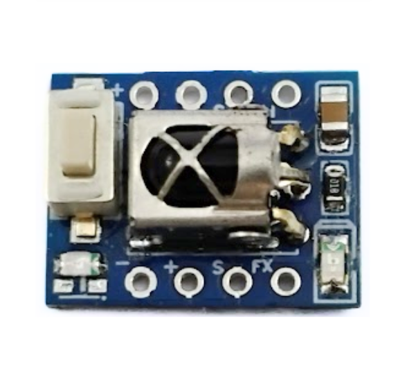](Sensores/IrKey) |[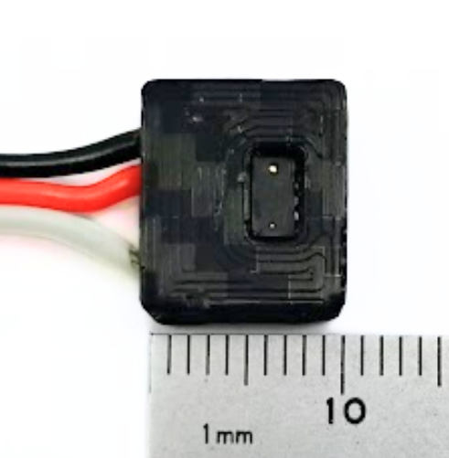](Sensores/fxs200/) |
|:---:|:--------:|:--------:|
| [FX-S50](Sensores/fxs50) | [IR-Key](Sensores/IrKey) | [FX-S200](Sensores/fxs200) |
| [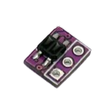](Sensores/linha) |  | |
| [Linha](Sensores/linha) |  |  |

## ESCs Brushed

| [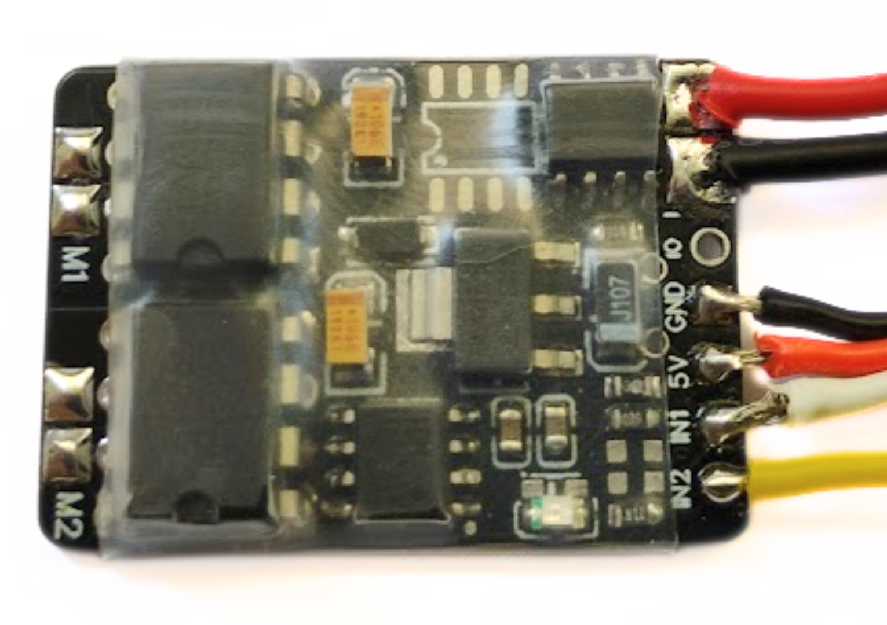](escs/esc_brushed_duplo) | [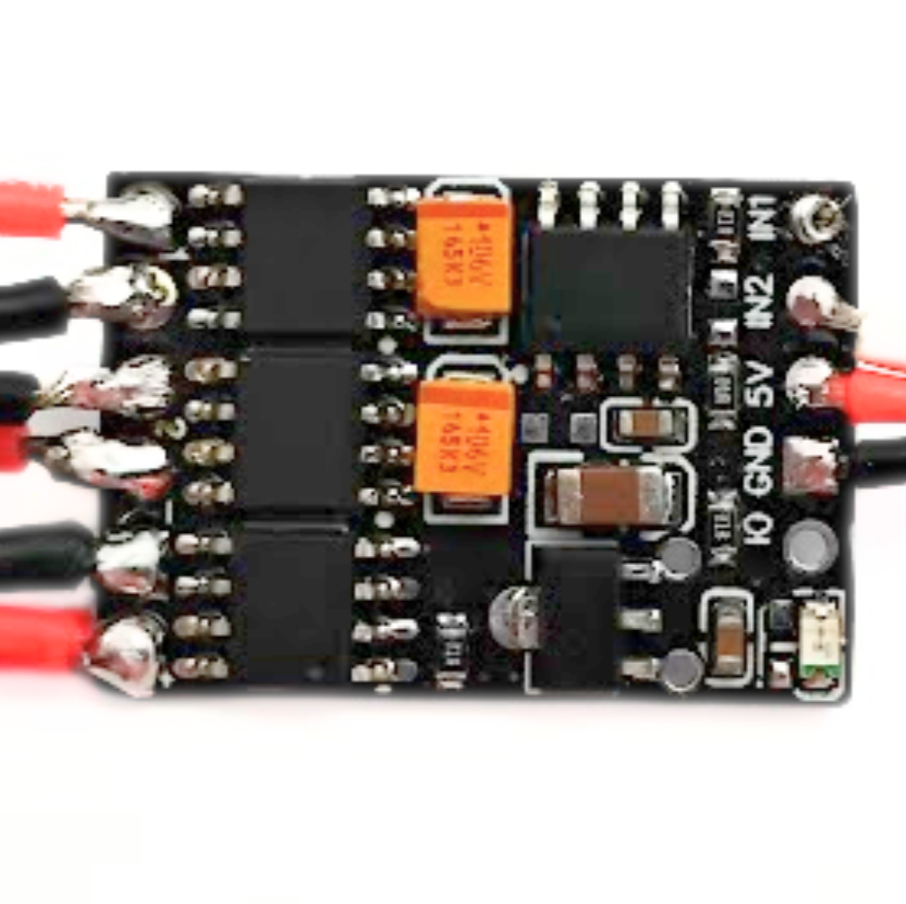](escs/esc_brushed_duplo) |[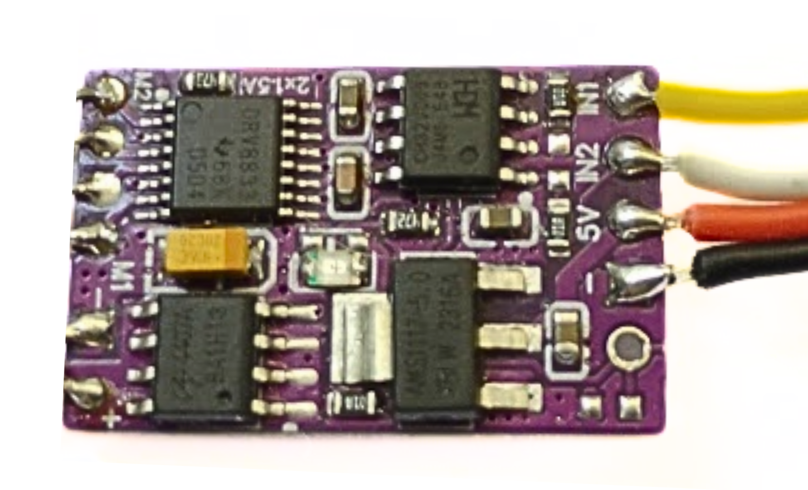](escs/esc_brushed_duplo) |
|:---:|:--------:|:--------:|
| [ESC Brushed 2x5A](escs/esc_brushed_duplo) | [ESC Brushed 2x3A](escs/esc_brushed_duplo) | [ESC Brushed 2x1.5A](escs/esc_brushed_duplo) |

## Controladoras

| [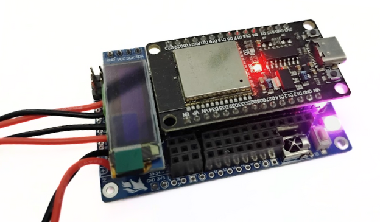](controladoras/FoxMini_ESP32) | [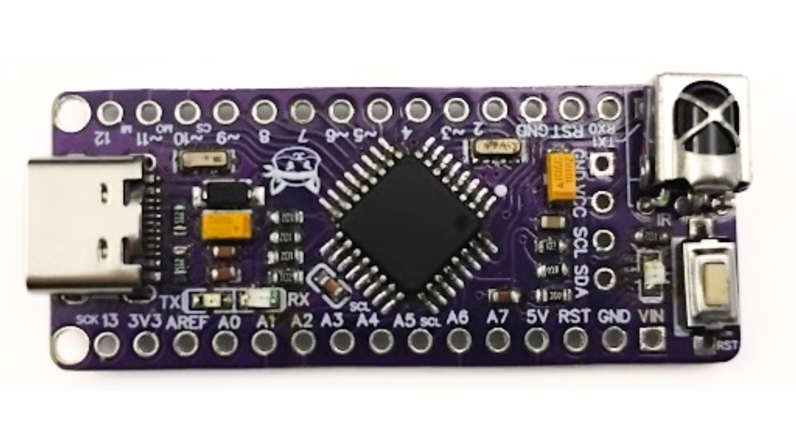](controladoras/FoxNanoV0) | 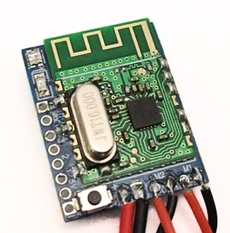 |
|:----:|:--------:|:--------:|
|  [FoxMini-ESP32](controladoras/FoxMini_ESP32)  |  [FoxNano V0](controladoras/FoxNanoV0) |  BBRX-FS  |

## Chaves gerais para combate

| [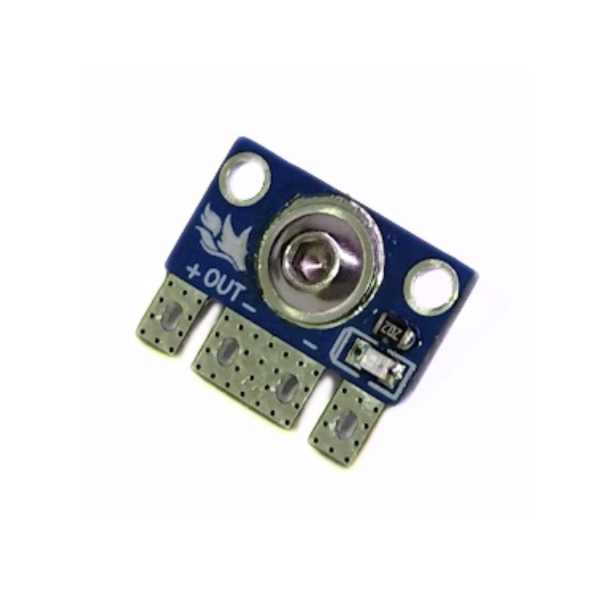](outros/chaves_combate) | [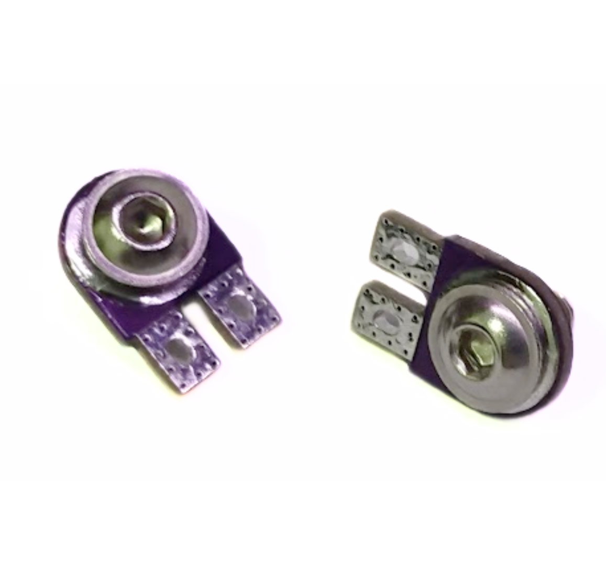](outros/chaves_combate) |
|:---:|:--------:|
| [Chave com LED](outros/chaves_combate) | [Micro Chave](outros/chaves_combate) |
