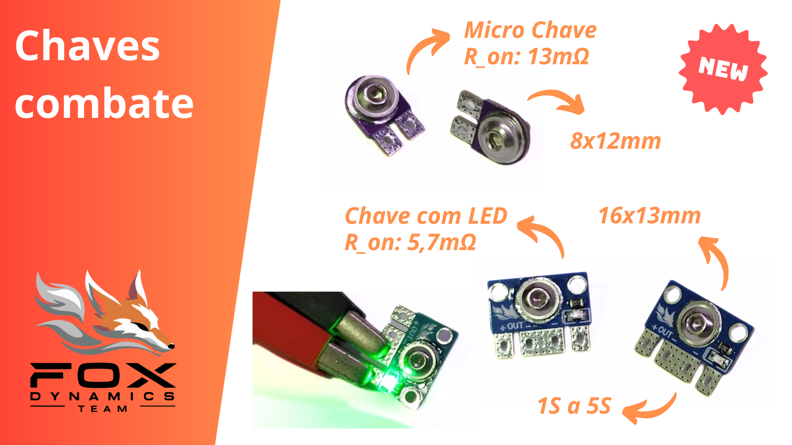

# Chaves gerais para combate  

Chaves Gerais para combate de robôs insetos. 

## Caracteristica técnicas  

| Característica     | Chave com LED  | Micro Chave  |
|--------------------|--------------|--------------|
| Cores | Verde, Azul e Vermelho | - |
| Tensão de operação | 3 a 21V | - |
| Resistência        | 5,7 mΩ  | 13 mΩ  |
| Dimensões          | 16,2 x 12,9 mm | 8,1 x 12,2 mm |
| Altura             | 7,5 mm | 7,5 mm |
| Peso               | 1,2 g  | 1,0 g  |

---

  

