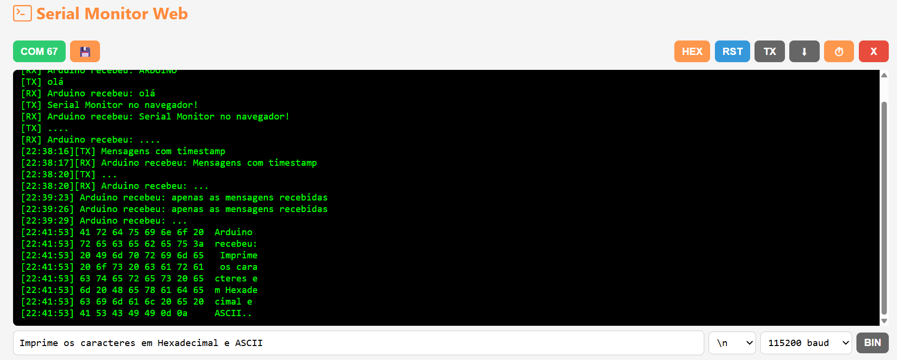
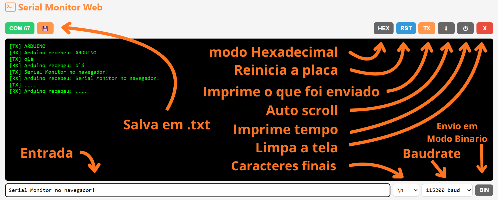
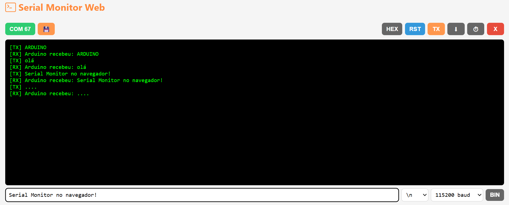
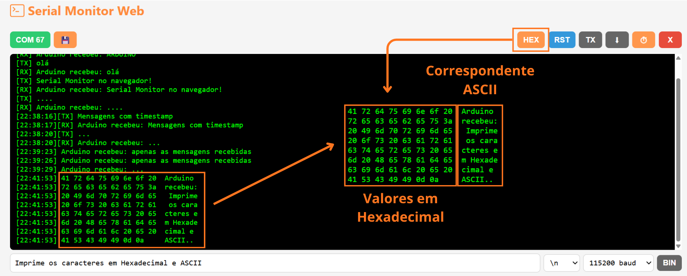
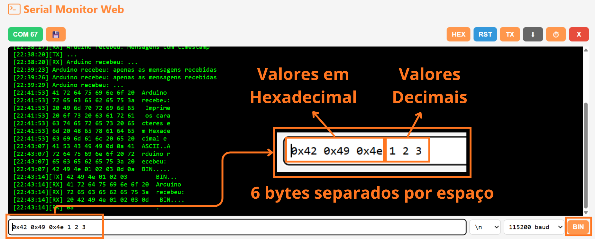

# Serial Monitor

🔗 [Serial Monito Web](https://luisf18.github.io/FoxLink_web_tool/serial.html)

Inspirado no Serial Monitor da IDE do Arduino, o **Serial Monitor Web** é uma ferramenta para comunicação serial que funciona diretamente no navegador, sem precisar instalar uma IDE ou qualquer outro software.

A ideia é simples: **abrir o navegador, conectar a placa e começar a testar**.

Além das funções tradicionais de um Serial Monitor, ele possui alguns recursos voltados especialmente para testes e debug de comunicação UART, incluindo envio de bytes em modo binário e visualização em hexadecimal.



## Por que um Serial Monitor Web?

O Serial Monitor da IDE do Arduino é muito útil para monitorar dados e fazer debug de projetos com Arduino, ESP32 e outros microcontroladores.

Porém, para um teste rápido, abrir uma IDE completa pode ser desnecessário. E quando a IDE não está instalada, é preciso instalar todo o ambiente apenas para fazer uma comunicação serial simples.

O Serial Monitor Web foi criado para resolver justamente esse problema:

> **Abriu o navegador, conectou a placa e pronto.**

<!--Não é necessário instalar uma IDE, driver específico da ferramenta ou outro programa para começar a utilizar o monitor.-->

## Conexão

Ao abrir a ferramenta, selecione a porta serial correspondente à placa.

Depois de conectar, a comunicação pode ser utilizada normalmente para receber e enviar dados.

O monitor pode ser utilizado com diferentes dispositivos que disponibilizem uma interface serial, como:

- Arduino
- ESP32
- Conversores USB-Serial
- Outros microcontroladores com comunicação UART

## Interface



A interface é dividida em três partes principais:

- **Conexão e saída serial:** seleção da porta e área onde os dados recebidos são exibidos.
- **Controles:** opções para alterar a forma como os dados são apresentados e controlar a comunicação.
- **Entrada:** campo utilizado para enviar dados para a placa.

## Botões e seletores

- **`Save`** salva em `.txt` a saida.
- **`RST`** executa o reset fisico do dispositivo conectado se tiver suporte para isso.Funciona por exemplo com Arduino UNO, Nano e ESP32.
- **`HEX`** Modo de exibição em hexadecimal.
- **`TX`** Habilita a impressão dos dados enviados. quando esta habilitado eles são identificados como: `[TX]<...>` e as recepções passam a ser 
`[RX]<...>`.
- **`AutoRoll`** Habilita a rolagem automatica a medida que os dados são enviados ou recebidos.

- **`Clear`** Limpa a saida.

- **`Caracteres de fim`** Seleção dos caracteres de encerramento que serão adicionados ao final da entrada.

- **`BIN`** Modo de entrada numérico.

## Envio de texto

O modo padrão permite enviar texto para a porta serial.




<!--
Por exemplo:
```text
Serial Monitor no navegador!
```
-->

## Modo de exibição Hexadecimal **`HEX`**

Exibe os caracteres recebidos em formato de hexdump. 8 caracteres por linha com seus respectivos valores a esquerda, e os mesmos caracteres ao final com o simbolo equivalente na tabela ASCII. Muito util pra visualizar os valores reais enviados e principalmente valores sem correspondência na tabela ASCII.



## Modo de entrada numérica **`BIN`**

Ao inves de usar caracteres a entrada passa a aceitar os valores de cada byte separado por espaço. Os valores podem ser em base decimal de 0 a 255 ou em hexadecimal com o prefixo 0x pra identifica como 0x80 que é 128 em decimal.


